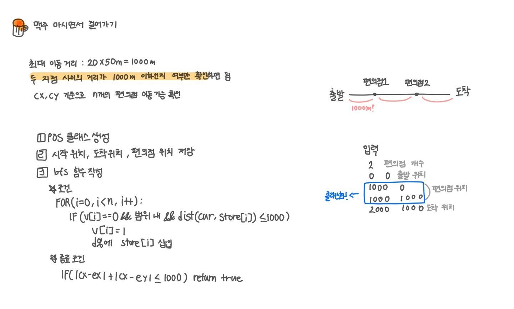
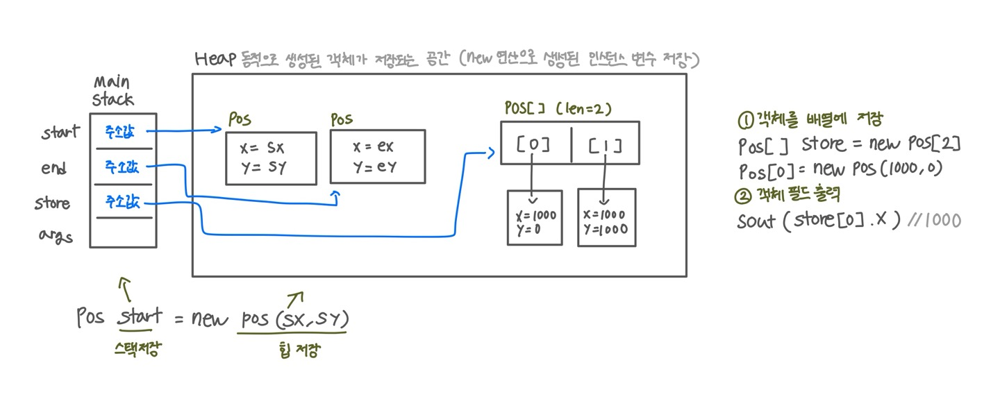

<br>

---

[https://www.acmicpc.net/problem/9205](https://www.acmicpc.net/problem/9205)

---

<br>

# 🔍 문제 풀이

## 문제 설명

> 문제는 집 -> 축제까지 갈 수 있냐 확인하는 것

- 두 지점 사이 거리가 1000m 이하면 이동 가능
- 결국 연결 여부만 확인하면 되므로 bfs 또는 dfs를 사용해야 함

<br>

## 문제 도식화

각 지점(집, 편의점, 축제)을 노드로 보기



<br><br>

## 메모리 구조 들여다보기

자바 메모리 구조가 궁금해져서 조만간 공부 후 포스팅 해야겠다



<br><br>

# 💻 코드

## 전체 코드

### 클래스 미사용

```java
import java.io.*;
import java.util.*;

public class Main {
    static int[][] store;
    static int[] v;

    static int n, sx, sy, ex, ey;
    public static void main(String[] args) throws IOException {
        BufferedReader br = new BufferedReader(new InputStreamReader(System.in));

        StringBuilder sb = new StringBuilder();
        int t = Integer.parseInt(br.readLine());
        while(t --> 0){
            n = Integer.parseInt(br.readLine()); // 편의점 수

            store = new int[n][2]; // 편의점 위치
            StringTokenizer st = new StringTokenizer(br.readLine());
            sx = Integer.parseInt(st.nextToken());
            sy = Integer.parseInt(st.nextToken());

            for(int i=0; i<n; i++){
                st = new StringTokenizer(br.readLine());
                store[i][0] = Integer.parseInt(st.nextToken());
                store[i][1] = Integer.parseInt(st.nextToken());
            }

            st = new StringTokenizer(br.readLine());
            ex = Integer.parseInt(st.nextToken());
            ey = Integer.parseInt(st.nextToken());


            if (bfs()) sb.append("happy\n");
            else sb.append("sad\n");
        }
        System.out.print(sb);
    }

    static boolean bfs(){
        // 1. 초기화
        Deque<int[]> dq = new ArrayDeque<>();
        v = new int[n];

        // 2. 시작점 세팅
        dq.offer(new int[]{sx, sy});

        // 3. 탐색
        while(!dq.isEmpty()) {
            int[] cur = dq.poll();
            int cx = cur[0];
            int cy = cur[1];

            // 3-1 종료조건
            if (dist(cx, cy, ex, ey) <= 1000) return true;

            // 3-2 편의점 탐색
            for (int i = 0; i < store.length; i++) {
                if (v[i] == 0) {
                    int nx = store[i][0], ny = store[i][1];
                    if (dist(cx, cy, nx, ny) <= 1000) {
                        v[i] = 1;
                        dq.offer(new int[]{nx, ny});
                    }
                }
            }
        }
        return false;
    }

    static int dist(int x1, int y1, int x2, int y2) {
        return Math.abs(x1 - x2) + Math.abs(y1 - y2);
    }
}
```

<br>

### 클래스 사용

```java
import java.io.*;
import java.util.*;

public class Main {
    static Pos[] store;
    static int[] v;
    static int n;
    static Pos start, end;

    public static void main(String[] args) throws IOException {
        BufferedReader br = new BufferedReader(new InputStreamReader(System.in));

        StringBuilder sb = new StringBuilder();
        int t = Integer.parseInt(br.readLine());
        while(t --> 0){
            n = Integer.parseInt(br.readLine()); // 편의점 수
            store = new Pos[n];

            StringTokenizer st = new StringTokenizer(br.readLine());
            int sx = Integer.parseInt(st.nextToken());
            int sy = Integer.parseInt(st.nextToken());
            start = new Pos(sx, sy);

            for (int i = 0; i < n; i++) {
                st = new StringTokenizer(br.readLine());
                int x = Integer.parseInt(st.nextToken());
                int y = Integer.parseInt(st.nextToken());
                store[i] = new Pos(x, y);
            }

            st = new StringTokenizer(br.readLine());
            int ex = Integer.parseInt(st.nextToken());
            int ey = Integer.parseInt(st.nextToken());
            end = new Pos(ex, ey);

            if (bfs()) sb.append("happy\n");
            else sb.append("sad\n");
        }
        System.out.print(sb);
    }

    static boolean bfs(){
        // 1. 초기화
        Deque<Pos> dq = new ArrayDeque<>();
        v = new int[n];

        // 2. 시작점 세팅
        dq.offer(start);

        // 3. 탐색
        while(!dq.isEmpty()) {
            Pos cur = dq.poll();

            // 3-1 종료조건
            if (dist(cur, end) <= 1000) return true;

            // 3-2 편의점 탐색
            for (int i = 0; i < n; i++) {
                if (v[i] == 0 && dist(cur, store[i]) <= 1000) {
                    v[i] = 1;
                    dq.offer(store[i]);
                }
            }
        }
        return false;
    }

    static int dist(Pos a, Pos b) {
        return Math.abs(a.x - b.x) + Math.abs(a.y - b.y);
    }

    static class Pos {
        int x, y;
        Pos(int x, int y) {
            this.x = x;
            this.y = y;
        }
    }
}
```

<br>

## 스켈레톤 코드

```java
import java.io.*;
import java.util.*;

public class Main {
    static Pos[] store;
    static int[] v;
    static int n;
    static Pos start, end;

    public static void main(String[] args) throws IOException {
        BufferedReader br = new BufferedReader(new InputStreamReader(System.in));

        StringBuilder sb = new StringBuilder();
        int t = Integer.parseInt(br.readLine());
        while(t --> 0){
            n = Integer.parseInt(br.readLine()); // 편의점 수
            store = new Pos[n];

            StringTokenizer st = new StringTokenizer(br.readLine());
            int sx = Integer.parseInt(st.nextToken());
            int sy = Integer.parseInt(st.nextToken());


        }
    }

    static boolean bfs(){


        return false;
    }

    static int dist(Pos a, Pos b) {

    }

    static class Pos {


    }
}
```

<br>
