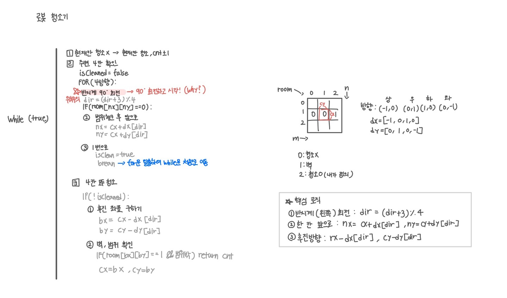

<br>

---

[https://www.acmicpc.net/problem/14503](https://www.acmicpc.net/problem/14503)

---

<br>

# 🔍 문제 풀이

## 문제 도식화



<br>

> 반시계(왼쪽) 방향으로 회전

그냥 `d-1` 하면 음수가 될 수 있으니까, 아래와 같이 `+ 3`을 더해 왼쪽 회전 해주기

```java
d = (d + 3) % 4; // 반시계 방향으로 회전
```

<br>

## ❓ 질문

아직 해결이 안돼서 해결 후 업데이트 하겠습니다!


<br><br>

# 💻 전체 코드

```java
import java.io.*;
import java.util.*;

public class Main {
    static int n, m, cx, cy, dir;
    static int[][] room;
    static int count;

    static int[] dx = {-1, 0, 1, 0}; // 북 동 남 서
    static int[] dy = {0, 1, 0, -1};

    public static void main(String[] args) throws IOException {
        BufferedReader br = new BufferedReader(new InputStreamReader(System.in));

        // 입력 및 초기화
        StringTokenizer st = new StringTokenizer(br.readLine());
        n = Integer.parseInt(st.nextToken());
        m = Integer.parseInt(st.nextToken());

        room = new int[n][m];
        st = new StringTokenizer(br.readLine());
        cx = Integer.parseInt(st.nextToken());
        cy = Integer.parseInt(st.nextToken());
        dir = Integer.parseInt(st.nextToken());

        for(int i=0; i<n; i++){
            st = new StringTokenizer(br.readLine());
            for(int j=0; j<m; j++){
                room[i][j] = Integer.parseInt(st.nextToken());
            }
        }

        int ans = cleanRoom();
        System.out.println(ans);
    }

    static int cleanRoom(){
        int cnt = 0;

        while(true){
            // 현재 칸 청소 여부 확인
            if(room[cx][cy] != 2){
                room[cx][cy] = 2;
                cnt++;
            }

            // 주변 4칸 청소 여부 확인
            boolean isCleaned = false;
            for(int d=0; d<4; d++){
                dir = (dir + 3) % 4; // 반시계 회전
                int nx = cx + dx[dir];
                int ny = cy + dy[dir];

                if(nx < 0 || nx > n || ny < 0 || ny >= m) continue;
                if(room[nx][ny] == 0){ // 청소 안된 칸 존재
                    cx = nx; cy = ny; // 한 칸 앞으로
                    isCleaned = true;
                    break; // 다음 while 루프로
                }
            }

            if(!isCleaned){
                int bx = cx - dx[dir];
                int by = cy - dy[dir];

                if(bx < 0 || bx > n || by < 0 || by >= m || room[bx][by] == 1) return cnt;
                cx = bx; cy = by;
            }
        }
    }
}
```

<br>

## 스켈레톤 코드

```java
import java.io.*;
import java.util.*;

public class Main {
    static int n, m, cx, cy, dir;
    static int[][] room;
    static int count;

    static int[] dx = {-1, 0, 1, 0}; // 북 동 남 서
    static int[] dy = {0, 1, 0, -1};

    public static void main(String[] args) throws IOException {
        BufferedReader br = new BufferedReader(new InputStreamReader(System.in));

        // 입력 및 초기화
        StringTokenizer st = new StringTokenizer(br.readLine());
        n = Integer.parseInt(st.nextToken());
        m = Integer.parseInt(st.nextToken());

        room = new int[n][m];
        st = new StringTokenizer(br.readLine());
        cx = Integer.parseInt(st.nextToken());
        cy = Integer.parseInt(st.nextToken());
        dir = Integer.parseInt(st.nextToken());

        for(int i=0; i<n; i++){
            st = new StringTokenizer(br.readLine());
            for(int j=0; j<m; j++){
                room[i][j] = Integer.parseInt(st.nextToken());
            }
        }

        int ans = cleanRoom();
        System.out.println(ans);
    }

    static int cleanRoom(){
        int cnt = 0;


    }
}
```

<br>
