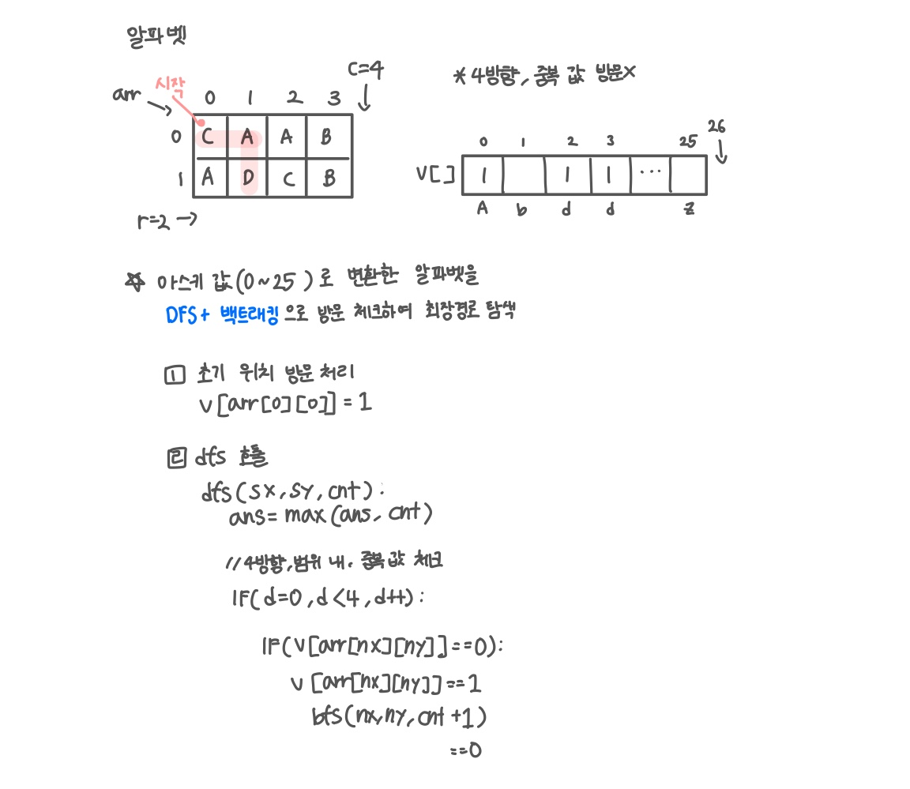

<br>

---

[https://www.acmicpc.net/problem/1987](https://www.acmicpc.net/problem/1987)

---

<br>

# 🔍 문제 풀이

## 문제 도식화

`cnt+1`은 새로운 스택에 복사 값을 넘겨 원래 값이 보존되지만, `cnt++`는 현재 스택의 cnt를 직접 바꿔 되돌릴 수 없다. 따라서 `cnt+1`을 사용해야 함!

cnt는 dfs 함수 스택 프레임 안에서만 존재하는 지역 변수라서, 호출될 때 스택 프레임에 저장되고 리턴하면 함께 사라진다.

매겨변수도 스택 프레임에 저장됨!



<br><br>

# 💻 코드

## 전체 코드

```java
import java.io.*;
import java.util.*;

public class Main {
    static int[][] arr;
    static int[] v;
    static int ans, r, c;
    static int[] dx = {-1, 1, 0, 0};
    static int[] dy = {0, 0, -1, 1};

    public static void main(String[] args) throws IOException {
        BufferedReader br = new BufferedReader(new InputStreamReader(System.in));

        StringTokenizer st = new StringTokenizer(br.readLine());
        r = Integer.parseInt(st.nextToken());
        c = Integer.parseInt(st.nextToken());

        arr = new int[r][c];
        v = new int[26];
        for(int i=0; i<r; i++){
            String line = br.readLine();
            for(int j=0; j<c; j++){
                arr[i][j] = line.charAt(j) - 'A';
            }
        }

        v[arr[0][0]] = 1; // 시작점 방문 처리
        dfs(0, 0, 1);
        System.out.println(ans);
    }

    static void dfs(int sx, int sy, int cnt){
        ans = Math.max(ans, cnt);

        for (int d = 0; d < 4; d++) {
            int nx = sx + dx[d];
            int ny = sy + dy[d];
            if (nx < 0 || ny < 0 || nx >= r || ny >= c) continue;

            int a = arr[nx][ny];
            if (v[a] == 0) {
                v[a] = 1;
                dfs(nx, ny, cnt + 1);
                v[a] = 0; // 백트래킹
            }
        }
    }
}
```

<br>
