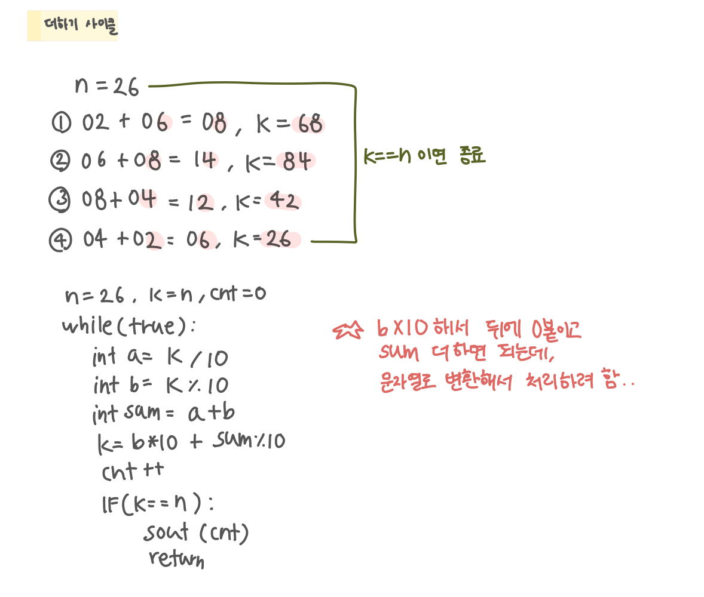

<br>

---

[https://www.acmicpc.net/problem/1110](https://www.acmicpc.net/problem/1110)

---

<br>

# 🔍 문제 풀이

## 문제 도식화



<br><br>

# 💻 코드

## 전체 코드

```java
import java.io.*;

public class Main {
    public static void main(String[] args) throws IOException {
        BufferedReader br = new BufferedReader(new InputStreamReader(System.in));


        int n = Integer.parseInt(br.readLine());
        int k = n, cnt = 0;

        while(true){
            int a = k / 10;
            int b = k % 10;
            int sum = a + b;

            k = b * 10 + sum % 10;
            cnt ++;
            if(k == n){
                System.out.println(cnt);
                return;
            }
        }

    }
}
```

<br>
