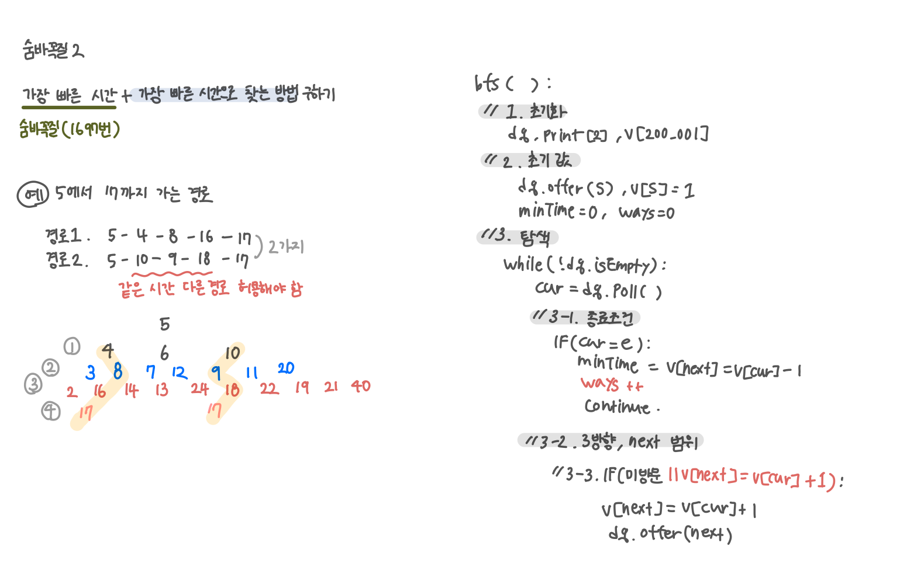

<br>

---

[https://www.acmicpc.net/problem/12851](https://www.acmicpc.net/problem/12851)

---

<br>

# 🔍 문제 풀이

## 문제 도식화

> 경로 개수 세기

- `v[next] == v[cur] + 1`:
  - 이미 방문했지만, 방문했던 시간이 지금 내가 오려는 시간과 동일
    - 즉, 다른 경로로도 같은 최단 시간에 또 올 수 있으면 허용

<br>



<br>

## 헷갈린 점

> 여러 경로를 다 찾으려면 BFS가 모든 경우를 다 검증해야할까?

- BFS는 최단 경로를 찾는 데 필요한 경우만 모두 검증하지, 0부터 200,000까지 무조건 다 도는 건 아님
- 즉, 여러 경로가 있다면 그 **최단 거리 안에서** 가능한 모든 경로만 큐에 담아 확인

<br>

> BFS에서 처음 만난 게 최단 시간

- BFS는 큐에 들어간 순서 = 이동 시간 순서라서, 가장 먼저 도착하면 이미 최소 시간
- 이후에 도착하는 경우는 반드시 같은 시간대(같은 레벨)이거나 더 느린 경우뿐임
- 그래서 `minTime = v[e] - 1;`은 최초로 정해지고 그대로 유지

<br><br>

# 💻 코드

## 전체 코드

```java
import java.io.*;
import java.util.*;

public class Main {
    static int[] v;

    static int s, e;

    public static void main(String[] args) throws IOException {
        BufferedReader br = new BufferedReader(new InputStreamReader(System.in));

        StringTokenizer st = new StringTokenizer(br.readLine());
        s = Integer.parseInt(st.nextToken());
        e = Integer.parseInt(st.nextToken());

        int[] ans = bfs();
        System.out.println(ans[0]);
        System.out.println(ans[1]);

    }

    static int[] bfs() {
        // 1. 초기화
        Deque<Integer> dq = new ArrayDeque<>();
        v = new int[200_001];
        int minTime = 0;
        int ways = 0;

        // 2. 초기값
        dq.offer(s);
        v[s] = 1;

        // 3. 탐색
        while(!dq.isEmpty()){
            int cur = dq.poll();
            // 3.1 종료조건
            if(cur == e){
                minTime = v[e] - 1; // 최초로 정해지고, 이후엔 같음 (처음 도착했을 때 값이 곧 최단 시간)
                ways ++; // 같은 레벨에서 e를 여러 번 만남 = 경로 수
                continue; // 같은 깊이에 또 도착할 수 있으니 계속 탐색
            }

            // 3.2 3방향, nx 범위
            int[] next = {cur + 1, cur - 1, cur * 2};
            for(int nx : next){
                if(nx < 0 || nx > 200_000) continue;

                // 3.3 미방문, 조건 추가
                if(v[nx] == 0 || v[nx] == v[cur] + 1){ // 방문하지 않았거나, 같은 시간으로 다시 올 수 있다면 허용
                    v[nx] = v[cur] + 1;
                    dq.offer(nx);
                }
            }
        }

        return new int[]{minTime, ways};
    }
}
```

<br>

## 스켈레톤 코드

```java
import java.io.*;
import java.util.*;

public class Main {
    static int[] v;

    static int s, e;

    public static void main(String[] args) throws IOException {
        BufferedReader br = new BufferedReader(new InputStreamReader(System.in));

        StringTokenizer st = new StringTokenizer(br.readLine());
        s = Integer.parseInt(st.nextToken());
        e = Integer.parseInt(st.nextToken());

        int[] ans = bfs();
        System.out.println(ans[0]);
        System.out.println(ans[1]);

    }

    static int[] bfs() {

    }
}
```

<br>
