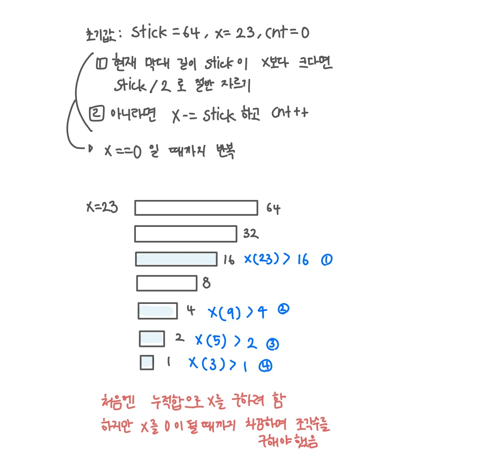

<br>

---

[https://www.acmicpc.net/problem/1094](https://www.acmicpc.net/problem/1094)

---

<br>

# 🔍 문제 풀이

## 문제 도식화



<br><br>

# 💻 코드

## 전체 코드

```java
import java.io.*;
import java.util.*;

public class Main {

    public static void main(String[] args) throws IOException {
        BufferedReader br = new BufferedReader(new InputStreamReader(System.in));

        int x = Integer.parseInt(br.readLine());
        int stick = 64, cnt = 0;

        while(x != 0){
            if(stick > x) stick = stick / 2;
            else {
                x -= stick;
                cnt++;
            }
        }
        System.out.println(cnt);

    }
}
```

<br>
