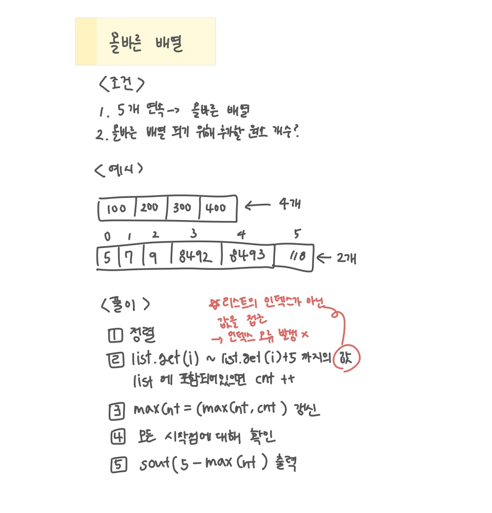

<br>

---

[https://www.acmicpc.net/problem/13913](https://www.acmicpc.net/problem/13913)

---

<br>

# 🔍 문제 풀이

## 문제 도식화

`for(int j=list.get(i); j<list.get(i) + 5; j++)`는 인덱스가 아닌 값에 접근하는 것이므로, `if(list.contains(j)) cnt++;` 했을 때 인덱스 오류가 발생하지 않음에 유의하자.



<br>

<br><br>

# 💻 코드

## 전체 코드

```java
import java.io.*;
import java.util.*;

public class Main {
    public static void main(String[] args) throws IOException {
        BufferedReader br = new BufferedReader(new InputStreamReader(System.in));

        int n = Integer.parseInt(br.readLine());
        List<Integer> list = new ArrayList<>();

        for(int i=0; i<n; i++){
            list.add(Integer.parseInt(br.readLine()));
        }

        Collections.sort(list); // 정렬

        int maxCnt = Integer.MIN_VALUE;
        for(int i=0; i<n; i++){
            int cnt = 0;
            // 현재 원소부터 5칸 구간 안에 포함된 수 세기
            for(int j=list.get(i); j<list.get(i) + 5; j++){
                if(list.contains(j)) cnt++;
            }
            maxCnt = Math.max(maxCnt, cnt); // 최대 포함 개수 갱신
        }


        System.out.println(5 - maxCnt); // 부족한 원소 개수 출력


    }
}
```

<br>

## 스켈레톤 코드

```java
import java.io.*;
import java.util.*;

public class Main {
    public static void main(String[] args) throws IOException {
        BufferedReader br = new BufferedReader(new InputStreamReader(System.in));

        int n = Integer.parseInt(br.readLine());
        List<Integer> list = new ArrayList<>();

        for(int i=0; i<n; i++){
            list.add(Integer.parseInt(br.readLine()));
        }


    }
}

```

<br>
