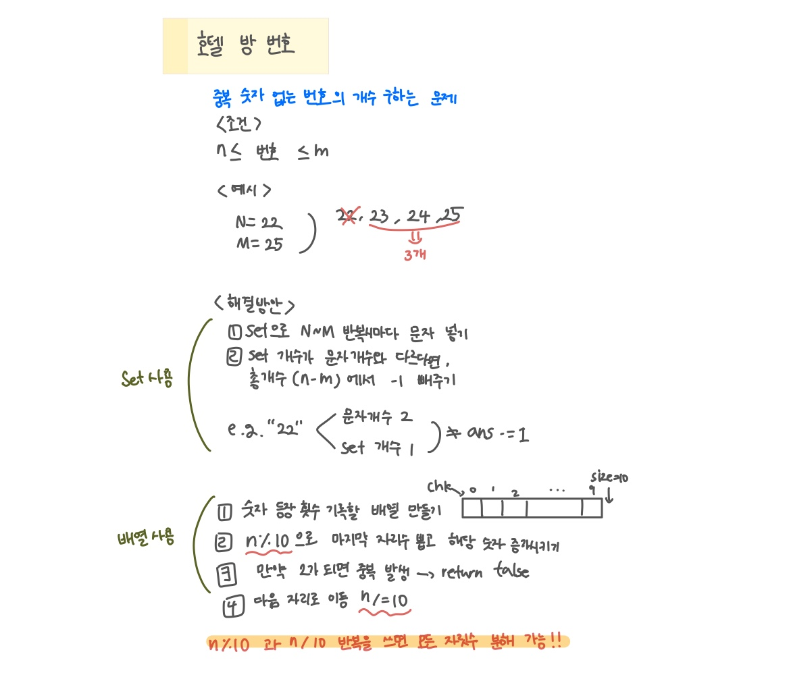

<br>

---

[https://www.acmicpc.net/problem/5671](https://www.acmicpc.net/problem/5671)

---

<br>

# 🔍 문제 풀이

## 문제 도식화




<br><br>

# 💻 코드

## 전체 코드

### [내 풀이] set사용

```java
import java.io.*;
import java.util.*;

public class Main {
    public static void main(String[] args) throws IOException {
        BufferedReader br = new BufferedReader(new InputStreamReader(System.in));

        String line;
        while((line = br.readLine()) != null){
            StringTokenizer st = new StringTokenizer(line);

            if(!st.hasMoreTokens()) break;

            int n = Integer.parseInt(st.nextToken());
            int m = Integer.parseInt(st.nextToken());

            int cnt = 0;
            for(int i=n; i<=m; i++){
                String s = String.valueOf(i);
                Set<Character> set = new HashSet<>();

                for(int j=0;j<s.length();j++){
                    char ch = s.charAt(j);
                    set.add(ch); // Set에 추가 (중복이면 안 들어감)
                    if(set.size() == s.length()) cnt++; // 자릿수 개수와 Set 크기 같으면 중복 없음

                }

            }
            System.out.println(cnt);
        }

    }
}

```

<br>

### [타인 풀이] 배열 사용 📌

> 맨 마지막 자리부터 차례대로 잘라가면서 검사

- `n % 10` = 현재 숫자의 맨 끝 (1의 자리)
- `n /= 10` = 끝 자리 버리고 다음 자리로 이동

```java
import java.io.*;
import java.util.*;

public class Main {
    public static void main(String[] args) throws IOException {
        BufferedReader br = new BufferedReader(new InputStreamReader(System.in));

        String line;
        while((line = br.readLine()) != null){
            StringTokenizer st = new StringTokenizer(line);

            if(!st.hasMoreTokens()) break;

            int n = Integer.parseInt(st.nextToken());
            int m = Integer.parseInt(st.nextToken());

            int cnt = 0;
            for(int i=n; i<=m; i++){
                if(check(i)) cnt++;
            }
            System.out.println(cnt);
        }


    }

    static boolean check(int n){
        int[] chk = new int[10];
        while (n != 0) {
            int d = n % 10; // 마지막 자리 숫자
            chk[d]++; // 해당 숫자 카운트 증가
            if (chk[d] == 2) // 만약 2가되면 중복 발생
                return false;
            n /= 10; // 다음 자리로 이동
        }
        return true;
    }
}
```

<br>
