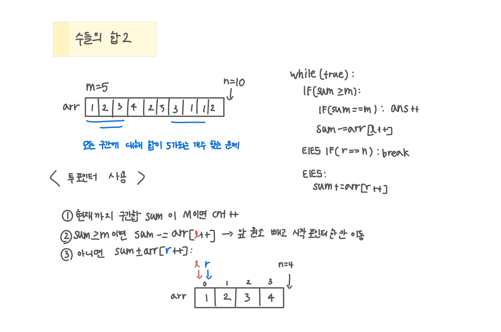

<br>

---

[https://www.acmicpc.net/problem/2003](https://www.acmicpc.net/problem/2003)

---

<br>

# 🔍 문제 풀이

## 문제 도식화

> 투 포인터 사용!

`sum < m` 일때 오른쪽 포인터(e) 이동하면서 값을 늘리고, `sum > m` 일때 왼쪽 포인터(s) 이동하면서 값을 줄임 ([투 포인터 개념](https://butter-shower.tistory.com/226))



<br><br>

# 💻 코드

## 전체 코드

- r이 n에 도달한 후에도 sum이 s 이상인 상태라면, l을 계속 이동시키며 남은 경우를 모두 확인해야 한다.
- 아래처럼 `r == n`이어도 `sum >= s`일 때는 먼저 수축을 실행하도록 작성해야 한다.
- `while (r < n || sum >= m)` 와 같이 작성할 수도 있다.

```java
import java.io.*;
import java.util.*;

public class Main {
    public static void main(String[] args) throws IOException {
        BufferedReader br = new BufferedReader(new InputStreamReader(System.in));

        StringTokenizer st = new StringTokenizer(br.readLine());
        int n = Integer.parseInt(st.nextToken());
        int m = Integer.parseInt(st.nextToken());

        int[] arr = new int[n];

        st = new StringTokenizer(br.readLine());
        for(int i=0; i<n; i++){
            arr[i] = Integer.parseInt(st.nextToken());
        }

        int l = 0, r = 0, sum = 0;
        int ans = 0;
        while(true){
            if(sum >= m){
                if(sum == m) ans ++;
                sum -= arr[l++];
            }
            else if(r==n) break;
            else sum += arr[r++];
        }


        System.out.println(ans);
    }
}
```

<br>
