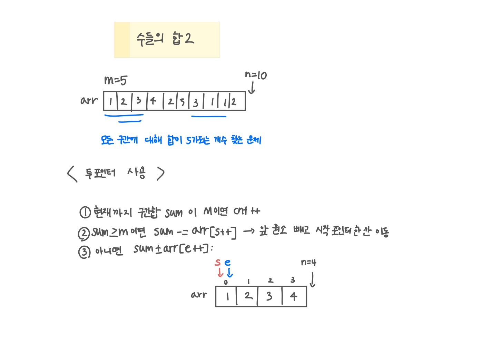

<br>

---

[https://www.acmicpc.net/problem/2003](https://www.acmicpc.net/problem/2003)

---

<br>

# 🔍 문제 풀이

## 문제 도식화

> 투 포인터 사용!

`sum < m` 일때 오른쪽 포인터(e) 이동하면서 값을 늘리고, `sum > m` 일때 왼쪽 포인터(s) 이동하면서 값을 줄임 ([투 포인터 개념](https://butter-shower.tistory.com/226))



<br><br>

# 💻 코드

## 전체 코드

```java
import java.io.*;
import java.util.*;

public class Main {
    public static void main(String[] args) throws Exception {
        BufferedReader br = new BufferedReader(new InputStreamReader(System.in));

        StringTokenizer st = new StringTokenizer(br.readLine());
        int n = Integer.parseInt(st.nextToken());
        int m = Integer.parseInt(st.nextToken());

        int[] arr = new int[n];
        st = new StringTokenizer(br.readLine());
        for(int i=0; i<n; i++) {
            arr[i] = Integer.parseInt(st.nextToken());
        }

        int s = 0, e = 0, sum = 0, cnt = 0;
        while(true){
            if(sum >= m){
                if(sum == m) cnt++;
                sum -= arr[s++];
            }else{
                if(e == n) break;
                sum += arr[e++];
            }
        }

        System.out.println(cnt);
    }
}
```

<br>
