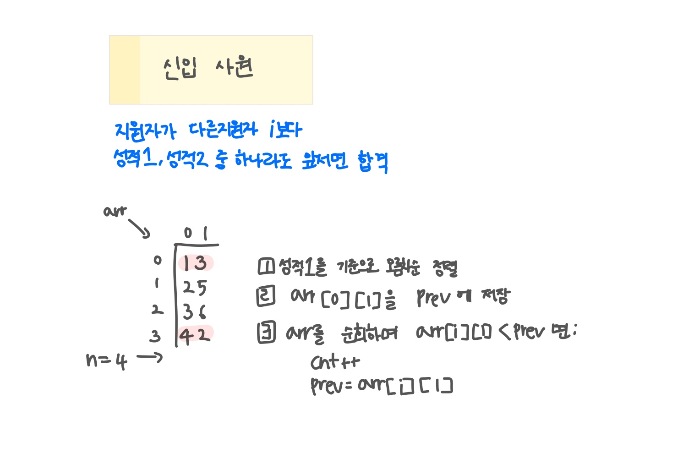

<br>

---

[https://www.acmicpc.net/problem/1946](https://www.acmicpc.net/problem/1946)

---

<br>

# 🔍 문제 풀이

## 문제 도식화



<br><br>

# 💻 코드

## 전체 코드

```java
import java.io.*;
import java.util.*;

public class Main {
    public static void main(String[] args) throws IOException {
        BufferedReader br = new BufferedReader(new InputStreamReader(System.in));

      int t = Integer.parseInt(br.readLine());
      while(t --> 0){
          int n = Integer.parseInt(br.readLine());

          int[][] arr = new int[n][2];

         for(int i=0; i<n; i++){
             StringTokenizer st = new StringTokenizer(br.readLine());
             arr[i][0] = Integer.parseInt(st.nextToken());
             arr[i][1] = Integer.parseInt(st.nextToken());
         }

          // 성적1 기준 오름차순 정렬
          Arrays.sort(arr, (a, b)->{
              return a[0] - b[0];
          });


          int ans = 1; // 첫 번째 지원자 무조건 합격
          int cur = arr[0][1]; // 성적2 최솟값 기록

         for(int i=1; i<n; i++){
             // 성적2가 이전 합격자보다 더 좋은 경우만 합격
            if(arr[i][1] < cur){
                ans++;
                cur = arr[i][1];
            }
         }
          System.out.println(ans);
      }
    }
}
```

<br>
