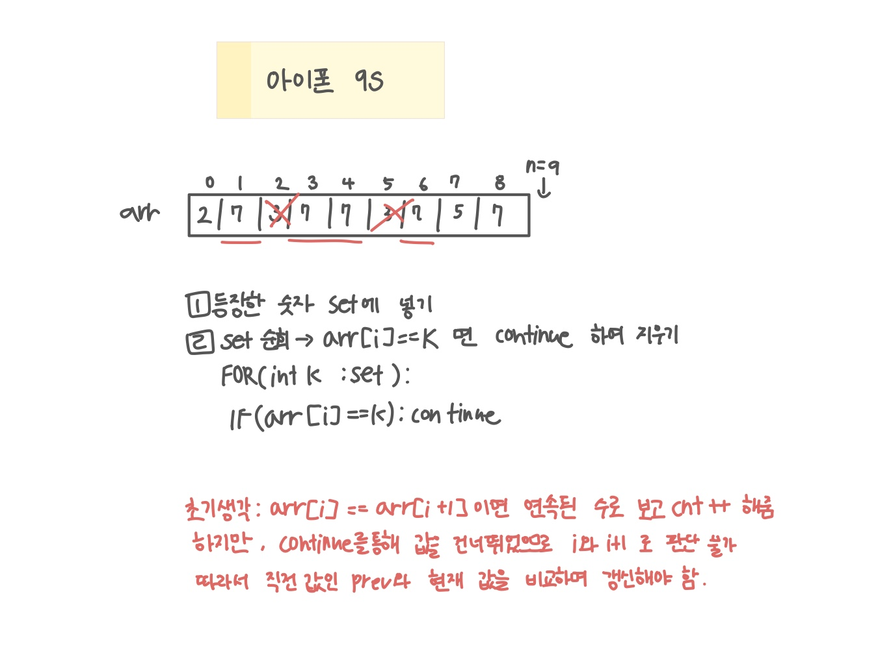

<br>

---

[https://www.acmicpc.net/problem/5883](https://www.acmicpc.net/problem/5883)

---

<br>

# 🔍 문제 풀이

## 문제 도식화



<br><br>

# 💻 코드

## 전체 코드

```java
import java.io.*;
import java.util.*;

public class Main {

    public static void main(String[] args) throws Exception {
        BufferedReader br = new BufferedReader(new InputStreamReader(System.in));

        int n = Integer.parseInt(br.readLine());
        int[] arr = new int[n];
        Set<Integer> set = new HashSet<>(); // 제거할 숫자 집합

        for(int i=0; i<n; i++) {
            int x = Integer.parseInt(br.readLine());
            arr[i] = x;
            set.add(x);
        }


        int ans = 1; // 연속 최장 길이

        for(int k:set){
            int cnt = 1; // 현재 연속 길이
            int prev = -1;

            for(int i=0; i<n; i++){
                if(arr[i] == k) continue; // k 제거(건너뛰기)

                if(prev == arr[i]) {
                    cnt++;
                    ans = Math.max(ans, cnt);
                }else cnt = 1;

                prev = arr[i];
            }

        }

        System.out.println(ans);
    }
}
```

<br>
