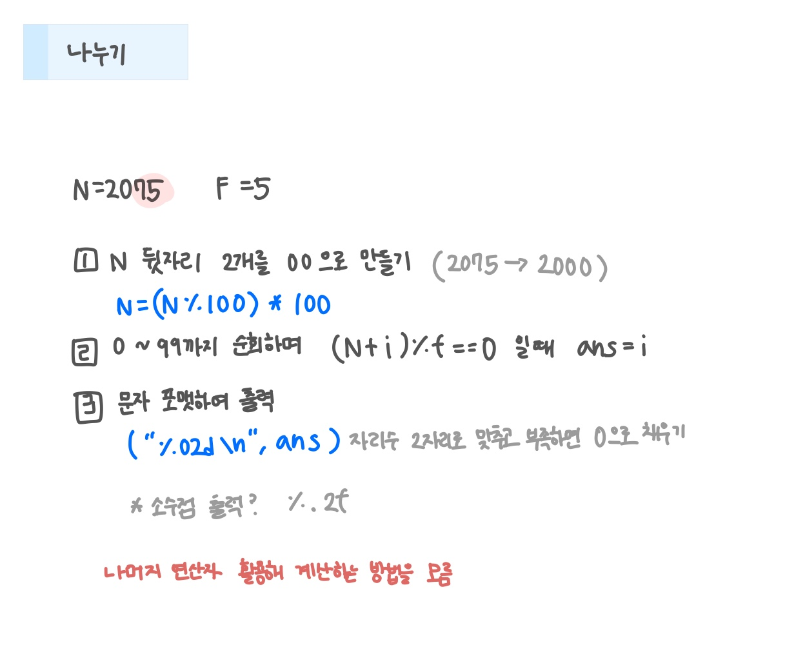

<br>

---

[https://www.acmicpc.net/problem/1075](https://www.acmicpc.net/problem/1075)

---

<br>

# 🔍 문제 풀이

## 문제 도식화



<br><br>

# 💻 코드

## 전체 코드

```java
import java.io.*;

public class Main {
    public static void main(String[] args) throws Exception {
        BufferedReader br = new BufferedReader(new InputStreamReader(System.in));

        int n = Integer.parseInt(br.readLine());
        int f = Integer.parseInt(br.readLine());

        n = (n / 100) * 100;

        int ans = 0;
        for (int i = 0; i < 100; i++) {
            if ((n + i) % f == 0) {
                ans = i;
                break;
            }
        }
        System.out.printf("%02d\n", ans);
    }
}
```

<br>
