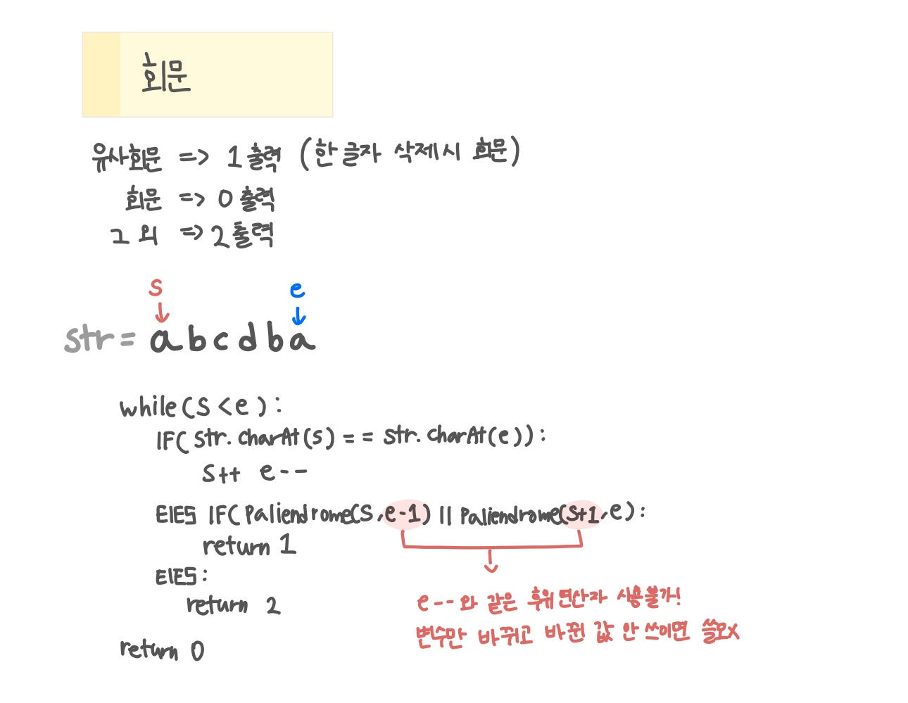

<br>

---

[https://www.acmicpc.net/problem/17609](https://www.acmicpc.net/problem/17609)

---

<br>

# 🔍 문제 풀이

## 문제 도식화

> 양 끝 **포인터**로 문자를 비교하며 불일치 시 좌·우 한 글자 제외 케이스를 각각 검사해 결과 판별



<br><br>

# 💻 코드

## 전체 코드

```java
import java.io.*;

public class Main {
    static String str;
    public static void main(String[] args) throws Exception {
        BufferedReader br = new BufferedReader(new InputStreamReader(System.in));

        int n = Integer.parseInt(br.readLine());
        while(n --> 0){
            str = br.readLine();

            int ans = check();
            System.out.println(ans);
        }
    }

    // 0: 회문, 1: 유사 회문, 2: 불가능
    static int check(){
        int s = 0, e = str.length()-1;
        while(s < e){
            if(str.charAt(s) == str.charAt(e)) {
                s++; e--; // 같으면 포인터 이용
            } else if (isPalindrome(s, e-1) || isPalindrome(s+1, e)){
                return 1; // 한글자 제외했을 때 같으면 유사회문
            } else{
                return 2; // 회문x
            }
        }
        return 0;
    }

    // 구간 [s, e] 팰린드롬 검사
    static boolean isPalindrome(int s, int e){
        while(s < e){
            if(str.charAt(s) != str.charAt(e)) return false;
            else {
                s++; e--;
            }
        }
        return true;
    }
}
```

<br>
