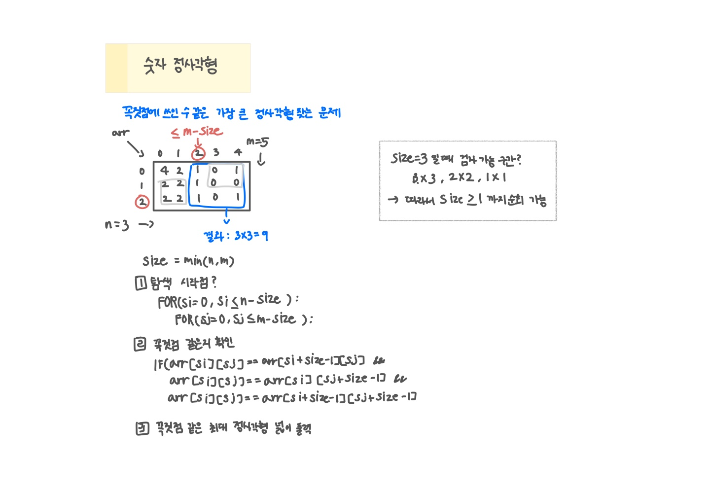

<br>

---

[https://www.acmicpc.net/problem/1051](https://www.acmicpc.net/problem/1051)

---

<br>

# 🔍 문제 풀이

## 문제 도식화



<br><br>

# 💻 코드

## 전체 코드

```java
import java.io.*;
import java.util.StringTokenizer;

public class Main {
    static int[][] arr;

    public static void main(String[] args) throws IOException {
        BufferedReader br = new BufferedReader(new InputStreamReader(System.in));

        StringTokenizer st = new StringTokenizer(br.readLine());
        int n = Integer.parseInt(st.nextToken());
        int m = Integer.parseInt(st.nextToken());

        arr = new int[n][m];
        for(int i=0; i<n; i++){
            String line = br.readLine();
            for(int j=0; j<m; j++){
                arr[i][j] = line.charAt(j) - '0';
            }
        }
        int size = Math.min(n, m);

        // 변 크기 줄여가며 확인
        while (size >= 1) {
            // 탐색 가능한 꼭짓점의 시작 좌표
            for (int si = 0; si <= n - size; si++) {
                for (int sj = 0; sj <= m - size; sj++) {
                    if (solve(si, sj, size)) {
                        System.out.println(size * size);
                        return;
                    }
                }
            }
            size--;
        }
    }

    // 꼭짓점 같은지 확인
    static boolean solve(int si, int sj, int size){
        if(arr[si][sj] == arr[si + size-1][sj] &&
        arr[si][sj] == arr[si][sj + size-1] &&
        arr[si][sj] == arr[si + size-1][sj+size-1]) return true;
        else return false;
    }
}
```

<br>
