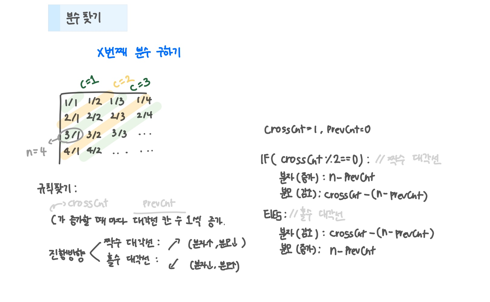

<br>

---

[https://www.acmicpc.net/problem/1193](https://www.acmicpc.net/problem/1193)

---

<br>

# 🔍 문제 풀이

## 문제 도식화



<br><br>

# 💻 코드

## 전체 코드

```java
import java.io.*;

public class Main {
    public static void main(String[] args) throws IOException {
        BufferedReader br = new BufferedReader(new InputStreamReader(System.in));

        int n = Integer.parseInt(br.readLine());
        int crossCnt = 1; // 현재 대각선 번호
        int prevCnt = 0; // 지금까지 지난 칸

        while(true){
            // n이 현재 대각선 안에 있으면
            if (n <= prevCnt + crossCnt) {
                // 짝수 대각선 -> 아래에서 위로 (분자 ↑, 분모 ↓)
                if (crossCnt % 2 == 0) {
                    System.out.print((n - prevCnt) + "/" + (crossCnt - (n - prevCnt - 1)));
                    break;
                }

                else {
                    // 홀수 대각선 -> 위에서 아래로 (분자 ↓, 분모 ↑)
                    System.out.print((crossCnt - (n - prevCnt - 1)) + "/" + (n - prevCnt));
                    break;
                }

            // 아직 아니면 다음 대각선으로
            } else {
                prevCnt += crossCnt;
                crossCnt++;
            }
        }

    }
}
```

<br>
