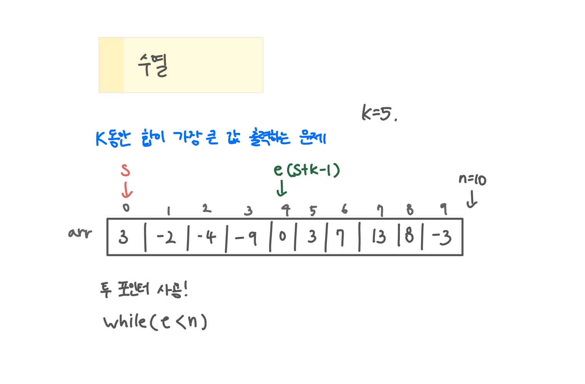

<br>

---

[https://www.acmicpc.net/problem/2559](https://www.acmicpc.net/problem/2559)

---

<br>

# 🔍 문제 풀이

## 문제 도식화

투 포인터를 사용하면 쉽게 풀 수 있는 문제이다!



<br><br>

# 💻 코드

## 전체 코드

```java
import java.io.*;
import java.util.*;

public class Main {
    public static void main(String[] args) throws IOException {
        BufferedReader br = new BufferedReader(new InputStreamReader(System.in));

        StringTokenizer st = new StringTokenizer(br.readLine());
        int n = Integer.parseInt(st.nextToken());
        int k = Integer.parseInt(st.nextToken());

        int[] arr = new int[n];
        st = new StringTokenizer(br.readLine());
        for(int i=0; i<n; i++){
            arr[i] = Integer.parseInt(st.nextToken());
        }

        int s = 0, e = s+k-1;

        int max = Integer.MIN_VALUE;
        while(e<n){
            int sum = 0;
            for(int i=s; i<=e; i++){
                sum += arr[i];
            }
            max = Math.max(max , sum);
            s++; e++;
        }

        System.out.println(max);
    }
}
```

<br>
