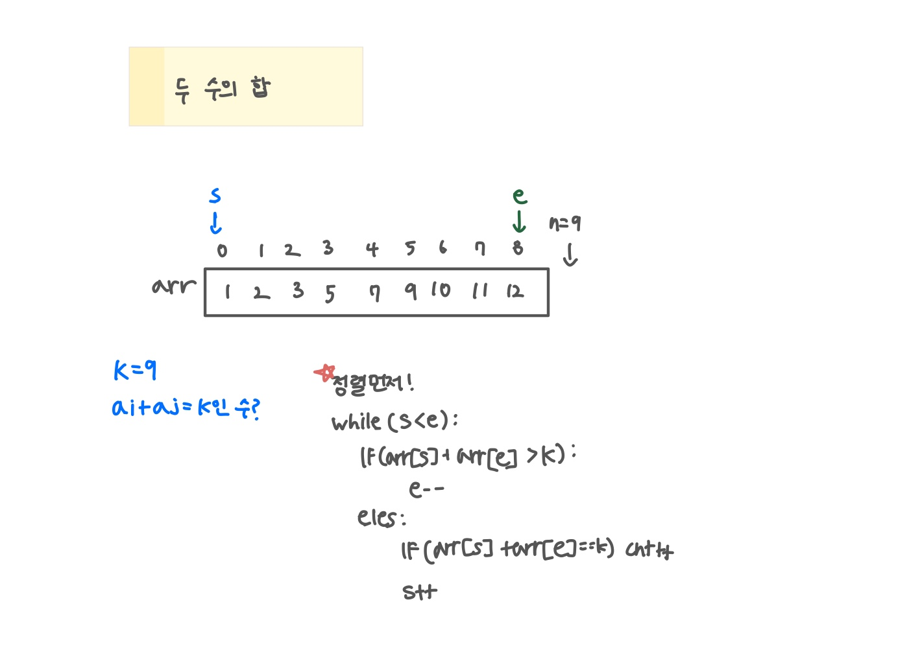

<br>

---

[https://www.acmicpc.net/problem/3273](https://www.acmicpc.net/problem/3273)

---

<br>

# 🔍 문제 풀이

## 문제 도식화

정렬을 해야 한쪽 방향으로만 움직일 수 있다.

- 합이 작으면 왼쪽 포인터만 `++`
- 합이 크면 오른쪽 포인터만 `--`



<br><br>

# 💻 코드

## 전체 코드

```java
import java.io.*;
import java.util.*;

public class Main {
    public static void main(String[] args) throws IOException {
        BufferedReader br = new BufferedReader(new InputStreamReader(System.in));

        int n = Integer.parseInt(br.readLine());
        int[] arr = new int[n];

        StringTokenizer st = new StringTokenizer(br.readLine());
        for(int i=0; i<n; i++){
            arr[i] = Integer.parseInt(st.nextToken());
        }

        int k = Integer.parseInt(br.readLine());

        Arrays.sort(arr);

        int cnt = 0, s = 0, e = n-1;
        while(s<e){
            if(arr[s] + arr[e] > k) e--;
            else{
                if(arr[s] + arr[e] == k) cnt++;
                s++;
            }
        }

        System.out.println(cnt);
    }
}
```

<br>
