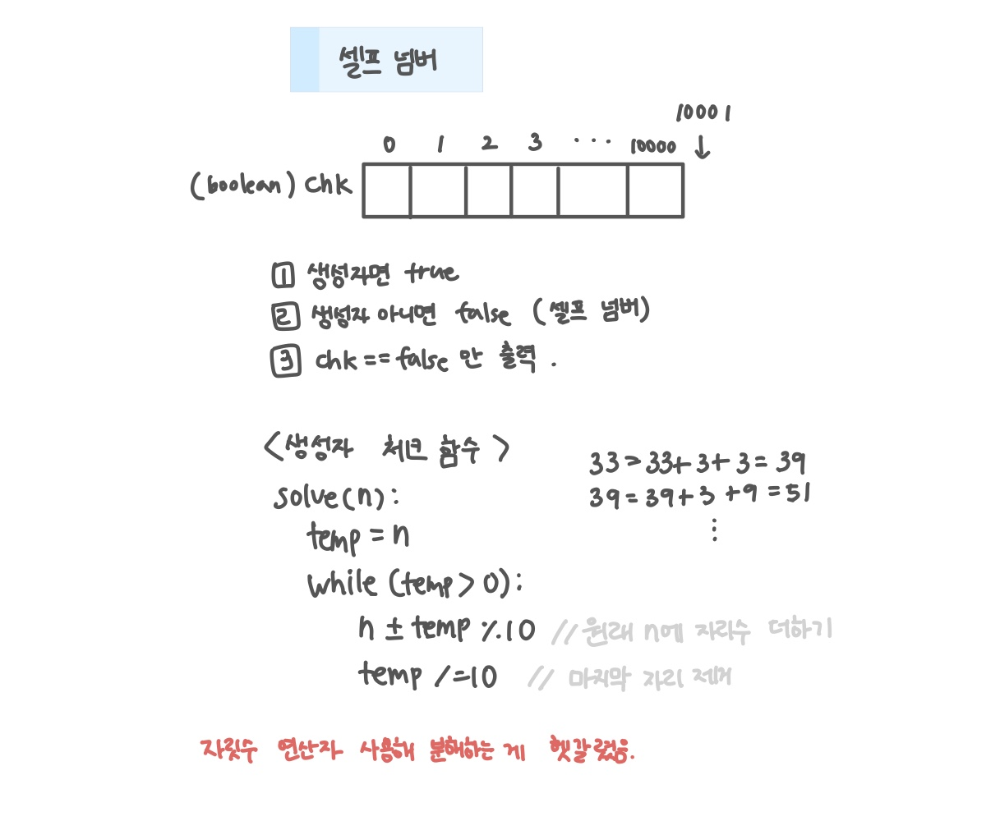

<br>

---

[https://www.acmicpc.net/problem/4673](https://www.acmicpc.net/problem/4673)

---

<br>

# 🔍 문제 풀이

## 문제 도식화

이런 자릿수 연산자로 분해하는 문제가 아직 낯설다..🥲



<br>

## 연산자 분해 방법

> **[방법1]** 연산자 활용 📌

`%`와 `/`로 자리수를 추출해서 합산

```java
    // n의 각 자릿수 모두 더하기
    static void solve(int n) {
        int tmp = n;
        while (tmp != 0) {
            n += tmp % 10;// 원래 n에 자리수 더하기
            tmp /= 10; // 마지막 자리 제거
        }
        if (n <= 10000) chk[n] = true;
    }
```

<br>

> **[방법2]** 문자열 변환

String으로 바꿔서 각 문자를 숫자로 변환 후 합산

```java
    // n의 각 자릿수 모두 더하기
    static void solve(int n) {
        int sum = n;
        String s = String.valueOf(n);
        for(int i=0; i<s.length(); i++){
            sum += s.charAt(i) - '0';
        }
        if (sum <= 10000) chk[sum] = true;
    }
```

<br><br>

# 💻 코드

## 전체 코드

```java
import java.io.*;
import java.util.*;

public class Main {
    static boolean[] chk;
    public static void main(String[] args) throws IOException {
        BufferedReader br = new BufferedReader(new InputStreamReader(System.in));

        chk = new boolean[10_001];

        int n =1;
        while(n < 10_001){
            if (!chk[n]) {
                System.out.println(n);
            }
            solve(n);
            n++;
        }
    }

    // n의 각 자릿수 모두 더하기
    static void solve(int n) {
        int tmp = n;
        while (tmp != 0) {
            n += tmp % 10;// 원래 n에 자리수 더하기
            tmp /= 10; // 마지막 자리 제거
        }
        if (n <= 10000) chk[n] = true;
    }
}
```

<br>
