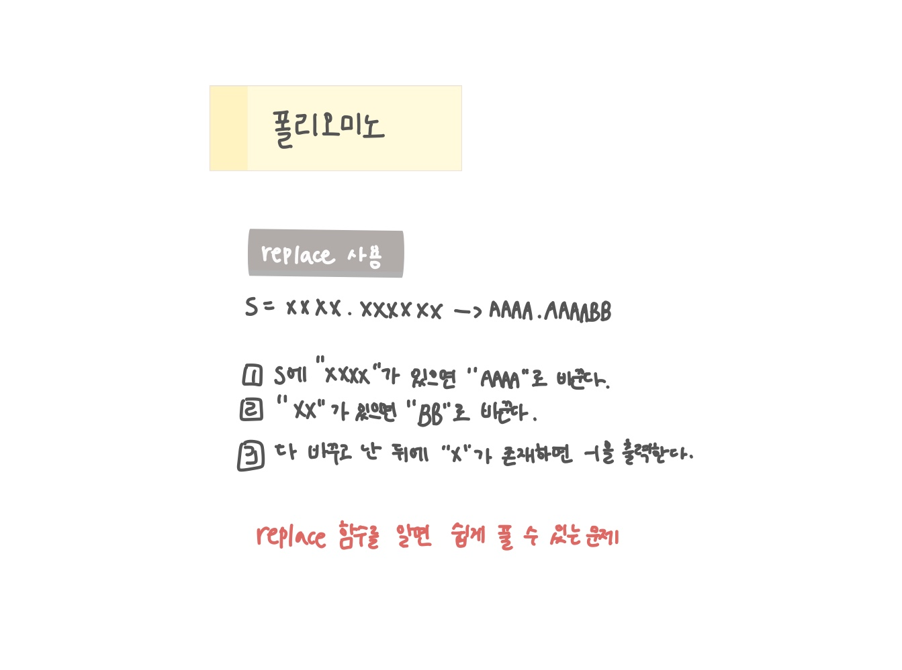

<br>

---

[https://www.acmicpc.net/problem/1343](https://www.acmicpc.net/problem/1343)

---

<br>

# 🔍 문제 풀이

## 문제 도식화



## Java 문자열 치환 (replace vs replaceAll)

> 단순 문자열 치환 (리터럴 기준)

| 메서드     | 특징             | 예시                                  |
| ---------- | ---------------- | ------------------------------------- |
| replace    | 단순 문자열 치환 | "XXXX".replace("XX","BB") → "BBBB"    |
| replaceAll | 정규식 기반 치환 | "a1b2".replaceAll("\\d","#") → "a#b#" |

정규식 안 쓰면 둘 다 결과는 같다!

<br>

> replace와 replaceAll는 한 번에 치환한다.

```java
String s = "XXXXXXXX";
s = s.replace("XXXX", "AAAA");
System.out.println(s); // AAAAAAAA
```

- "XXXXXXXX"가 "AAAAXXXX"로 바뀌고 다음 단계에서 또 치환된다고 생각했다.
- 하지만 실제로는 "XXXXXXXX"가 곧바로 "AAAAAAAA"로 변한다.
- 즉, replace와 replaceAll은 문자열 전체를 한 번에 치환하므로 반복문이 필요 없다.

<br>

> replace가 한 번에 치환되는 원리

자바 문자열은 불변이라서 replace나 replaceAll은 원본을 바꾸지 않고,

1. 문자열 전체를 처음부터 끝까지 스캔하여 패턴이 맞는 부분을 전부 기록
2. 한 번에 새 문자열로 만들어 반환

그래서 반복문 없이도 한 번에 전부 바뀌는 것!

<br><br>

# 💻 코드

## 전체 코드

### 초기코드

> contains로 "XXXX"나 "XX"가 있는지 확인 후 replace 실행

사실 필요 없는 중복 체크

```java
if(s.contains("XXXX")){
    s = s.replace("XXXX", "AAAA");
}
if(s.contains("XX")){
    s = s.replace("XX", "BB");
}
if(s.contains("X")){
    System.out.println(-1);
    return;
}
```

<br>

## 개선 코드

> 처음엔 contains를 썼지만, 사실 replace만으로 충분하다

1.  replace는 매칭되는 게 없으면 그대로 반환
2.  따라서 contains 조건문은 필요 없음
3.  마지막 "X" 남아있는지 확인만 하면 됨

```java
import java.io.*;
import java.util.*;

public class Main {
    public static void main(String[] args) throws IOException {
        BufferedReader br = new BufferedReader(new InputStreamReader(System.in));

        String s = br.readLine();

        s = s.replace("XXXX", "AAAA");
        s = s.replace("XX", "BB");
        if(s.contains("X")){
            System.out.println(-1);
            return;
        }

        System.out.println(s);

    }
}
```

<br>
