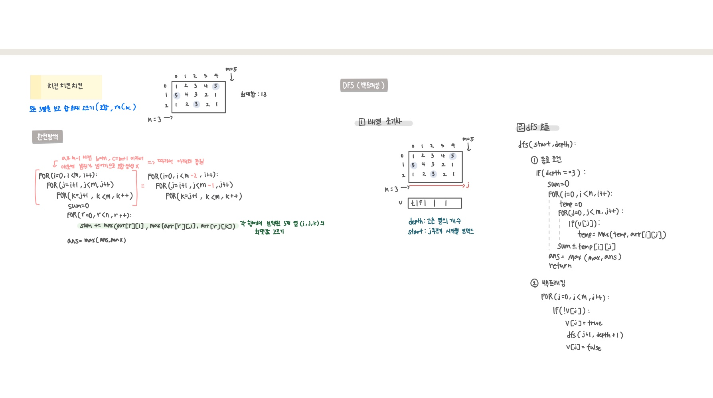

<br>

---

[https://www.acmicpc.net/problem/16439](https://www.acmicpc.net/problem/16439)

---

<br>

# 🔍 문제 풀이

## 문제 도식화

> `mC3` 구하는 문제

열을 먼저 돌고 `arr[행][열]` 이런식으로 최댓값 구하면 됨



<br><br>

# 💻 코드

## 완전탐색

```java
import java.io.*;
import java.util.*;

public class Main {
    static int n, m;
    static int[][] arr;
    public static void main(String[] args) throws IOException {
        BufferedReader br = new BufferedReader(new InputStreamReader(System.in));
        StringTokenizer st = new StringTokenizer(br.readLine());
        n = Integer.parseInt(st.nextToken()); // 회원 수
        m = Integer.parseInt(st.nextToken()); // 치킨 종류 수

        arr = new int[n][m];
        for(int i=0; i<n; i++){
            st = new StringTokenizer(br.readLine());
            for(int j=0; j<m; j++){
                arr[i][j] = Integer.parseInt(st.nextToken());
            }
        }
        int ans = solve();
        System.out.println(ans);

    }

    static int solve(){
        int ans = 0;
        for (int i = 0; i < m; i++) {
            for (int j = i + 1; j < m; j++) {
                for (int k = j + 1; k < m; k++) {
                    int sum = 0;
                    for (int r = 0; r < n; r++) {
                        sum += Math.max(arr[r][i], Math.max(arr[r][j], arr[r][k]));
                    }
                    ans = Math.max(ans, sum);
                }
            }
        }
        return ans;
    }
}
```

<br>

## DFS(백트래킹)

> 선택된 3개 열만 기준으로 모든 행을 돌며 그 셋 중 최댓값을 뽑아 sum에 누적

- start : 이번 깊이에서 시작할 열 인덱스
- depth : 현재까지 선택한 열 개수(0~3)

```java
import java.io.*;
import java.util.*;

public class Main {
    static int n, m;
    static int[][] arr;
    static boolean[] v;
    static int ans;

    public static void main(String[] args) throws IOException {
        BufferedReader br = new BufferedReader(new InputStreamReader(System.in));
        StringTokenizer st = new StringTokenizer(br.readLine());
        n = Integer.parseInt(st.nextToken()); // 회원 수
        m = Integer.parseInt(st.nextToken()); // 치킨 종류 수

        arr = new int[n][m];
        v = new boolean[m];
        for(int i=0; i<n; i++){
            st = new StringTokenizer(br.readLine());
            for(int j=0; j<m; j++){
                arr[i][j] = Integer.parseInt(st.nextToken());
            }
        }

        dfs(0, 0);
        System.out.println(ans);

    }

    static void dfs(int start, int depth){
        if(depth == 3) {
            int sum=0;
            for(int i = 0; i <n; i++){
                int temp=0;
                for(int j = 0; j <m; j++){ // 선택된 3열만 확인
                    if(v[j]){
                        temp = Math.max(temp, arr[i][j]);
                    }
                }
                sum+=temp;
            }
            ans = Math.max(sum, ans);
            return;
        }

        // 조합 생성
        for (int j = start; j < m; j++) {
            if(!v[j]){
                v[j] = true; // 열 j 선택
                dfs(j + 1, depth + 1);
                v[j] = false;
            }
        }
    }
}
```

<br>
