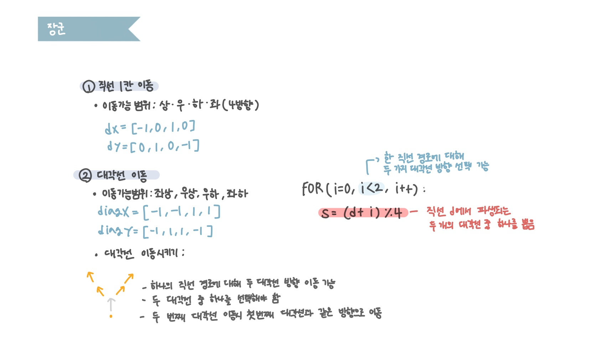

<br>

---

[https://www.acmicpc.net/problem/16509](https://www.acmicpc.net/problem/16509)

---

<br>

# 🔍 문제 풀이

## 문제 도식화



<br>

## 풀이 방법

> 각 단계에서 상하좌우 1칸, 이어서 해당 방향의 대각선 2칸 이동 가능

1. 먼저 첫 번째 4방향 (상하좌우 1칸)
   - 킹 있는지 체크
   - 범위 체크
2. 첫 번째 대각선 1칸 이동
   - 킹 있는지 체크
   - 범위 체크
3. 두 번째 대각선 같은 방향으로 1칸 이동
   - 최종 도착 좌표
   - 범위 체크 후, 방문하지 않았으면 큐에 추가

<br>

## 헷갈린점

> 어떻게하면 같은 대각선으로 이동하게 할 수 있을까?

- 첫 번째 대각선 방향을 정하면 두 번째 대각선도 같은 방향으로만 가야 한다.
- 대각선 방향을 한 번 정하면, 그 s를 그대로 두 번 반복해서 더해 같은 대각선 이동하게 할 수 있다.

```java
// 첫 번째 대각선
int nx = mx + diagX[s];
int ny = my + diagY[s];
// ...

// 두 번째 대각선 (같은 방향 s로 반복)
nx += diagX[s];
ny += diagY[s];

```

- `s = (d + i) % 4`
  - 직선 방향 d에서 파생된 두 대각선 중 하나 선택
  - e.g., d가 0일 때는 `(0+0)%4 = 0, (0+1)%4 = 1` -> 위쪽 두 대각선
- 첫 번째 대각선 이동 시 `diagX[s]`, `diagY[s]` 사용
- 두 번째도 똑같이 `diagX[s]`, `diagY[s]` 적용

<br><br>

# 💻 코드

```java
import java.io.*;
import java.util.*;

public class Main {
    static Pos start, end;
    static int[][] v;

    // 상우하좌
    static int[] dx = {-1,  0, 1, 0};
    static int[] dy = {0, 1, 0, -1};

    // 대각선 (좌상, 우상, 우하, 좌하)
    static int[] diagX = {-1,  -1,  1, 1};
    static int[] diagY = { -1,  1, 1, -1};

    public static void main(String[] args) throws IOException {
        BufferedReader br = new BufferedReader(new InputStreamReader(System.in));

        StringTokenizer st = new StringTokenizer(br.readLine());
        start = new Pos(Integer.parseInt(st.nextToken()), Integer.parseInt(st.nextToken()));

        st = new StringTokenizer(br.readLine());
        end = new Pos(Integer.parseInt(st.nextToken()), Integer.parseInt(st.nextToken()));

        int ans = bfs();
        System.out.println(ans);
    }

    static int bfs(){
        // 1. 초기화
        Deque<Pos> dq = new ArrayDeque<>();
        v = new int[10][9];

        // 2. 초기값
        v[start.x][start.y] = 1;
        dq.offer(start);

        // 3. 탐색
        while(!dq.isEmpty()){
            Pos cur = dq.poll();

            // 3.1 종료조건
            if(cur.x == end.x && cur.y ==end.y){
                return v[cur.x][cur.y] - 1;
            }

            // 3.2 이동, 범위체크

            // 상하좌우 먼저 이동
            for(int d = 0; d<4; d++){
                int mx = cur.x + dx[d];
                int my = cur.y + dy[d];

                if(mx < 0 || mx >= 10 || my < 0 || my >= 9) continue;
                if(mx == end.x && my == end.y) continue;

                // 대각선 2방향 이동
                for(int i = 0; i <2; i++){
                    int s = (d + i) % 4;

                    // 중간 대각선 이동
                    int nx = mx + diagX[s];
                    int ny = my + diagY[s];

                    if(nx < 0 || nx >= 10 || ny < 0 || ny >= 9) continue;
                    if(nx == end.x && ny == end.y) continue;

                    // 최종 대각선 이동 (같은 대각으로 한번 더)
                    nx += diagX[s];
                    ny += diagY[s];
                    if(nx < 0 || nx >= 10 || ny < 0 || ny >= 9) continue;


                    // 방문 처리
                    if(v[nx][ny] == 0){
                        v[nx][ny] = v[cur.x][cur.y] + 1;
                        dq.offer(new Pos(nx, ny));
                    }
                }

            }
        }
        return -1;
    }

    static class Pos{
        int x, y;

        Pos(int x, int y){
            this.x = x;
            this.y = y;
        }
    }
}

```

<br>
