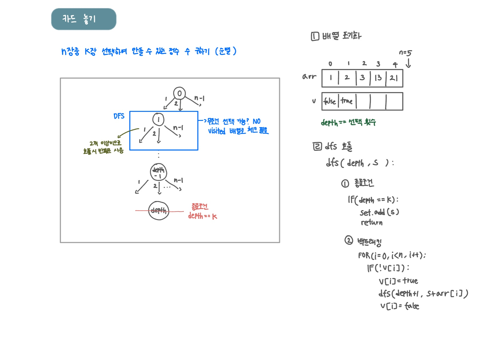

<br>

---

[https://www.acmicpc.net/problem/5568](https://www.acmicpc.net/problem/5568)

---

<br>

# 🔍 문제 풀이

## 문제 도식화



<br><br>

# 💻 코드

```java
import java.io.*;
import java.util.*;

public class Main {
    static int[] arr;
    static boolean[] v;
    static int n, k;
    static Set<String> set = new HashSet<>();

    public static void main(String[] args) throws IOException {
        BufferedReader br = new BufferedReader(new InputStreamReader(System.in));

        n = Integer.parseInt(br.readLine());
        k = Integer.parseInt(br.readLine());

        // 배열 초기화
        arr = new int[n];
        v = new boolean[n];
        for (int i = 0; i < n; i++) {
            arr[i] = Integer.parseInt(br.readLine());
        }

        dfs(0, "");
        System.out.println(set.size());
    }

    static void dfs(int depth, String s){
        // 종료 조건
        if(depth == k){
            set.add(s);
            return;
        }

        // 백트래킹
        for(int i=0; i<n; i++){
            if(!v[i]){
                v[i] = true;
                dfs(depth + 1, s + arr[i]);
                v[i] = false;
            }

        }

    }
}
```

<br>
