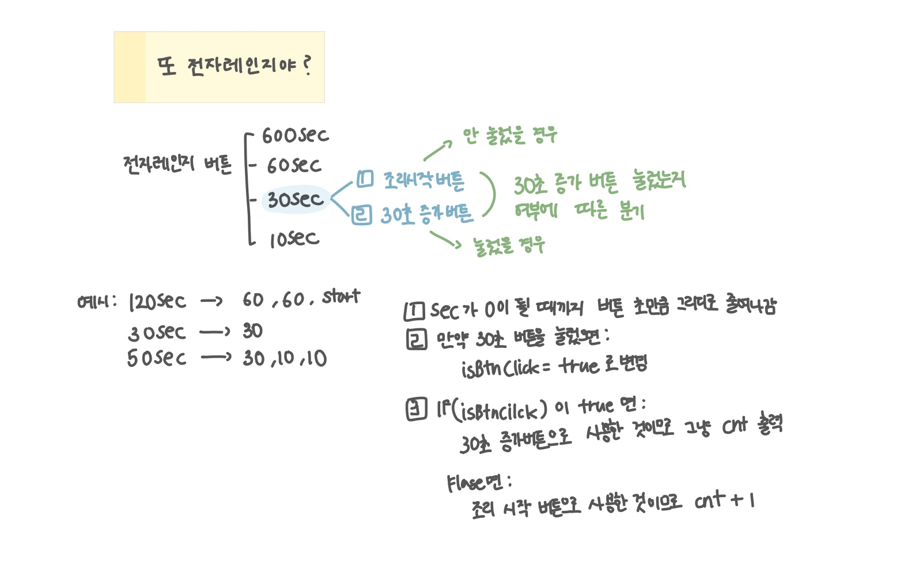

<br>

---

[https://www.acmicpc.net/problem/24390](https://www.acmicpc.net/problem/24390)

---

<br>

# 🔍 문제 풀이

## 문제 도식화

- 처음엔 BFS로 `dq.offer(30)`,` v[30]=1`로 시작해 30초 버튼을 기본으로 누른 상태로 탐색
- 하지만, 30초 버튼은 조리 시작과 +30초 증가 두 가지 역할을 동시에 가지므로 시작 여부를 별도 상태로 구분하지 못해 최단 횟수를 제대로 계산할 수 없음
- 따라서 그리디로 접근
  - 큰 단위부터 차감
  - 30초 버튼을 한 번이라도 사용했다면 시작 버튼을 이미 포함한 것으로 간주
  - 사용하지 않았다면 마지막에 시작 버튼을 +1 해주는 방식으로 최소 버튼 횟수 구했음

<br>



<br><br>

# 💻 코드

```java
import java.io.*;
import java.util.*;

public class Main {
    static int[] v;

    public static void main(String[] args) throws IOException {
        BufferedReader br = new BufferedReader(new InputStreamReader(System.in));

        String[] str = br.readLine().split(":");
        int sec = Integer.parseInt(str[0]) * 60 + Integer.parseInt(str[1]);

        int cnt = 0;
        boolean startBtn = false;

        while(sec > 0){
            if(sec >= 600){
                sec -= 600;
                cnt ++;
            } else if(sec >= 60){
                sec -= 60;
                cnt ++;
            } else if(sec >= 30){
                sec -= 30;
                cnt++;
                startBtn = true;
            } else {
                sec -= 10;
                cnt ++;
            }
        }

        if(startBtn) System.out.println(cnt);
        else System.out.println(cnt + 1);
    }
}
```

<br>
