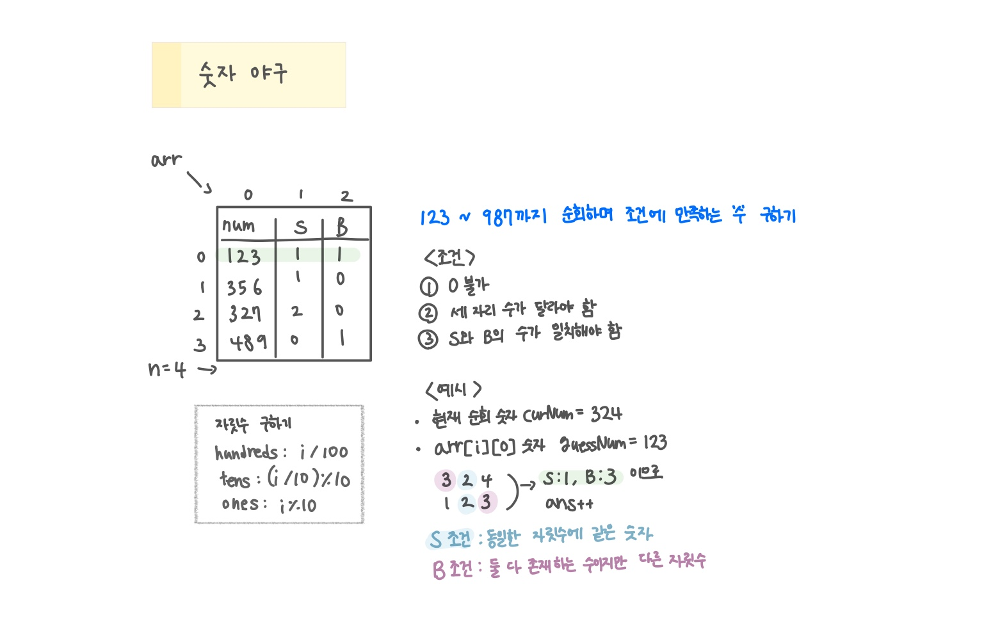

<br>

---

[https://www.acmicpc.net/problem/2503](https://www.acmicpc.net/problem/2503)

---

<br>

# 🔍 문제 풀이

## 문제 도식화



<br><br>

# 💻 코드

## 연산자 활용

```java
import java.io.*;
import java.util.*;

public class Main {
    static int n;
    static int[][] arr;

    public static void main(String[] args) throws IOException {
        BufferedReader br = new BufferedReader(new InputStreamReader(System.in));

        n = Integer.parseInt(br.readLine());
        arr = new int[n][3];

        for(int i=0; i<n; i++){
            StringTokenizer st = new StringTokenizer(br.readLine());
            arr[i][0] = Integer.parseInt(st.nextToken()); // 추측 숫자
            arr[i][1] = Integer.parseInt(st.nextToken()); // 스트라이크
            arr[i][2] = Integer.parseInt(st.nextToken()); // 볼
        }

        System.out.println(solve());
    }


    static int solve(){
        int ans = 0;

        for(int i=123; i<=987; i++){
            int d1 = i % 10;
            int d2 = (i / 10) % 10;
            int d3 = i / 100;

            // 0이 포함되거나 중복된 숫자가 있으면 건너뛰기
            if(d1 == 0 || d2 == 0 || d3 == 0) continue;
            if(d1 == d2 || d2 == d3 || d1 == d3) continue;

            // 모든 질문에 대해 확인해야함
            // 하나라도 틀리면 -> false
            for(int j=0; j<n; j++){
            boolean ok = true;
                int sCnt = 0, bCnt = 0;

                int num = arr[j][0];
                int s = arr[j][1];
                int b = arr[j][2];

                int c1 = num % 10;
                int c2 = (num / 10) % 10;
                int c3 = num / 100;

                // 스트라이크
                if(d1 == c1) sCnt++;
                if(d2 == c2) sCnt++;
                if(d3 == c3) sCnt++;

                // 볼
                if(d1 == c2 || d1 == c3) bCnt++;
                if(d2 == c1 || d2 == c3) bCnt++;
                if(d3 == c1 || d3 == c2) bCnt++;


                // 스트라이크와 볼의 개수가 일치하는지 확인
                if(sCnt != s || bCnt != b) {
                    ok = false;
                    break;
                }
            }
            if(ok) ans++;
        }

        return ans;
    }
}
```

<br>

## 문자열 변환

```java
static int solve() {
    int ans = 0;

    for (int i = 123; i <= 987; i++) {
        int d1 = i % 10;
        int d2 = (i / 10) % 10;
        int d3 = i / 100;

        // 0이 포함되거나 중복된 숫자가 있으면 건너뛰기
        if (d1 == 0 || d2 == 0 || d3 == 0) continue;
        if (d1 == d2 || d2 == d3 || d1 == d3) continue;

        boolean ok = true;
        for (int j = 0; j < n; j++) {
            int sCnt = 0, bCnt = 0;

            int num = arr[j][0];
            int s = arr[j][1];
            int b = arr[j][2];

            String curNumStr = String.valueOf(i);
            String guessNumStr = String.valueOf(num);

            // 모든 자릿수 조합 비교
            for (int k = 0; k < 3; k++) {
                for (int l = 0; l < 3; l++) {
                    if (curNumStr.charAt(k) == guessNumStr.charAt(l)) {
                        if (k == l) {
                            sCnt++; // 숫자가 같은데 위치도 같으면 -> 스트라이크
                        } else {
                            bCnt++; // 숫자는 같지만 위치가 다르면 -> 볼
                        }
                    }
                }
            }

            // 스트라이크와 볼의 개수가 일치하는지 확인
            if (sCnt != s || bCnt != b) {
                ok = false;
                break;
            }
        }

        if (ok) ans++;
    }

    return ans;
}
```

<br>
