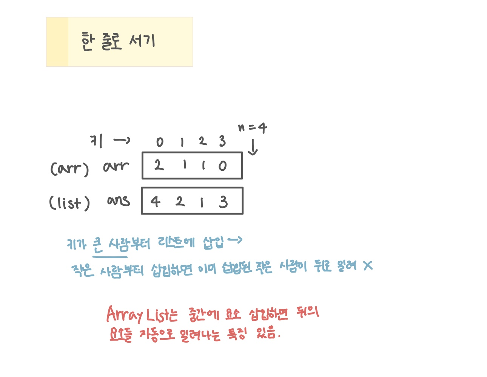

<br>

---

[https://www.acmicpc.net/problem/1138](https://www.acmicpc.net/problem/1138)

---

<br>

# 🔍 문제 풀이

## 문제 설명

"왼쪽에 있는 키 큰 사람 수"가 라는 정보가 주어질 때, 사람들이 최종적으로 서게 될 키 순번을 출력하는 문제

<br>

## 문제 도식화



<br><br>

# 💻 코드

## [방법 1] 키가 큰 사람부터 배치 (ArrayList)

> '왼쪽에 있는 큰 사람 수' 가 삽입할 위치의 인덱스가 되는 것을 이용해 `ArrayList`의 삽입 기능을 활용한다.

```java
import java.io.*;
import java.util.*;

public class Main {
    public static void main(String[] args) throws IOException {
        BufferedReader br = new BufferedReader(new InputStreamReader(System.in));


        int n = Integer.parseInt(br.readLine());
        int[] arr = new int[n];

        StringTokenizer st = new StringTokenizer(br.readLine());
        for(int i=0; i<n; i++){
            arr[i] = Integer.parseInt(st.nextToken());
        }

        List<Integer> ans = new ArrayList<>();
        for(int i=n-1; i>=0; i--){
            ans.add(arr[i], i+1);
        }

        for(int val: ans){
            System.out.print(val + " ");
        }

    }
}
```

<br>

## [방법 2] 키가 작은 사람부터 배치

> '왼쪽에 있는 큰 사람의 수'가 '왼쪽에 있는 빈칸의 수'와 같다는 점을 이용해 빈자리를 직접 찾아 사람을 채워 넣는다.

```java
import java.io.*;
import java.util.*;

public class Main {
    public static void main(String[] args) throws IOException {
        BufferedReader br = new BufferedReader(new InputStreamReader(System.in));


        int n = Integer.parseInt(br.readLine());
        int[] arr = new int[n];

        StringTokenizer st = new StringTokenizer(br.readLine());
        for(int i=0; i<n; i++){
            arr[i] = Integer.parseInt(st.nextToken());
        }
        int[] ans = new int[n];
        for(int i=0; i<n; i++){
            int cnt = 0;

            for(int j=0; j<n; j++){
                if(ans[j] != 0) continue;
                if(ans[j] == 0) {
                    if(cnt == arr[i]) {
                        ans[j] = i+1;
                        break;
                    }
                }
                cnt ++;
            }
        }

        for(int val:ans){
            System.out.print(val + " ");
        }
    }
}
```

<br>
