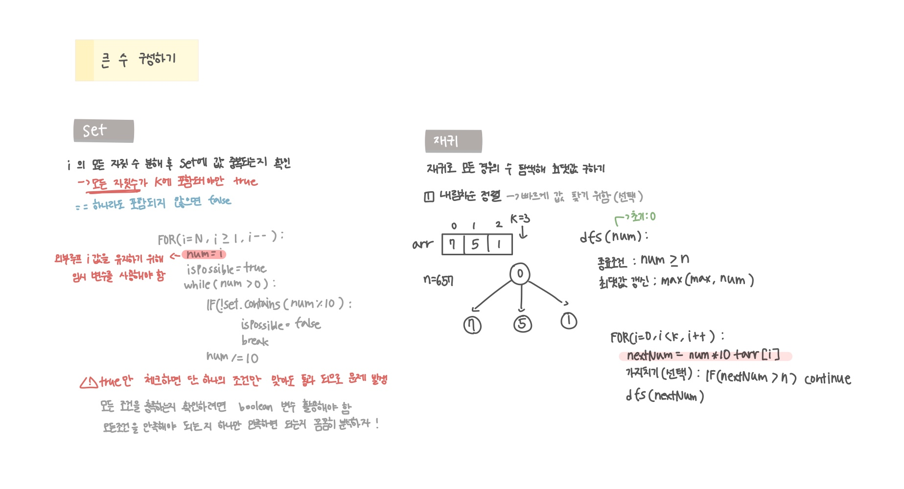

<br>

---

[https://www.acmicpc.net/problem/18511](https://www.acmicpc.net/problem/18511)

---

<br>

# 🔍 문제 풀이

## 문제 도식화



<br>

실행 시간은 비슷하다


<br><br>

# 💻 코드

## [방법 1] Set

```java
import java.io.*;
import java.util.*;

public class Main {
    public static void main(String[] args) throws IOException {
        BufferedReader br = new BufferedReader(new InputStreamReader(System.in));

        StringTokenizer st = new StringTokenizer(br.readLine());
        int n = Integer.parseInt(st.nextToken());
        int k = Integer.parseInt(st.nextToken());

        Set<Integer> set = new HashSet<>();

        st = new StringTokenizer(br.readLine());
        for(int i=0; i<k; i++){
            set.add(Integer.parseInt(st.nextToken()));
        }


        for(int i=n; i>=1; i--) {
            int num = i;
            boolean isPossible = true;

            while (num > 0) {
                int digit = num % 10;
                if (!set.contains(digit)) {
                    isPossible = false;
                    break;
                }
                num /= 10;
            }

            if(isPossible){
                System.out.println(i);
                return;
            }
        }
    }
}
```

<br>

## [방법 2] 재귀

```java
import java.io.*;
import java.util.*;

public class Main {
    static int n, k;
    static int[] arr;
    static int max = -1;

    public static void main(String[] args) throws IOException {
        BufferedReader br = new BufferedReader(new InputStreamReader(System.in));

        StringTokenizer st = new StringTokenizer(br.readLine());
        n = Integer.parseInt(st.nextToken());
        k = Integer.parseInt(st.nextToken());

        arr = new int[k];
        st = new StringTokenizer(br.readLine());
        for (int i = 0; i < k; i++) {
            arr[i] = Integer.parseInt(st.nextToken());
        }

        dfs(0);
        System.out.println(max);
    }

    static void dfs(int num) {
        if(num > n) return; // 종료조건
        max = Math.max(max, num); // 최댓값 갱신

        for(int i=0; i<k; i++){
            int nextNum = 10 * num + arr[i];
            if(nextNum > n) continue; // 가지치기(선택)
            dfs(nextNum);
        }

    }
}
```

<br>
