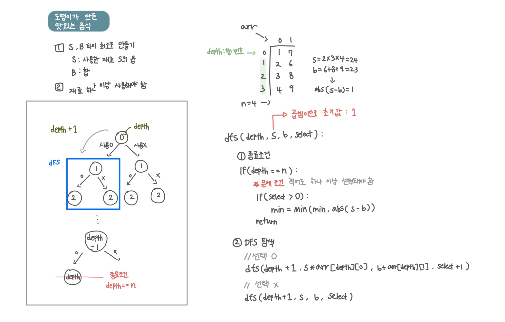

<br>

---

[https://www.acmicpc.net/problem/2961](https://www.acmicpc.net/problem/2961)

---

<br>

# 🔍 문제 풀이

## 문제 도식화

⚠️ 신맛은 곱셈이기 때문에 `dfs(0, 1, 0, 0)` 이렇게 `1`로 반드시 초기화 해줘야함



<br><br>

# 💻 코드

## 전체 코드

```java
import java.io.*;
import java.util.*;

public class Main {
    static int n;
    static int[][] arr;
    static boolean[][] v;
    static int min = Integer.MAX_VALUE;

    public static void main(String[] args) throws IOException {
        BufferedReader br = new BufferedReader(new InputStreamReader(System.in));

        n = Integer.parseInt(br.readLine());
        arr = new int[n][2];
        v = new boolean[n][2];

        for(int i=0; i<n; i++){
            StringTokenizer st = new StringTokenizer(br.readLine());
            arr[i][0] = Integer.parseInt(st.nextToken()); // 신맛
            arr[i][1] = Integer.parseInt(st.nextToken()); // 쓴맛
        }

        dfs(0, 1, 0, 0);
        System.out.println(min);
    }

    static void dfs(int depth, int s, int b, int select) {
        if (depth == n) {
            // 재료를 하나라도 사용했을 경우에만 최솟값 갱신
            if (select > 0) {
                min = Math.min(min, Math.abs(s - b));
            }
            return;
        }

        // 재료 사용 o
        dfs(depth + 1, arr[depth][0] * s, arr[depth][1] + b, select + 1);

        // 재료 사용 x
        dfs(depth + 1, s, b, select);
    }
}
```

<br>

## 스켈레톤 코드

```java
import java.io.*;
import java.util.*;

public class Main {
    static int n;
    static int[][] arr;
    static boolean[][] v;
    static int min = Integer.MAX_VALUE;

    public static void main(String[] args) throws IOException {
        BufferedReader br = new BufferedReader(new InputStreamReader(System.in));

        n = Integer.parseInt(br.readLine());
        arr = new int[n][2];
        v = new boolean[n][2];

        for(int i=0; i<n; i++){
            StringTokenizer st = new StringTokenizer(br.readLine());
            arr[i][0] = Integer.parseInt(st.nextToken()); // 신맛
            arr[i][1] = Integer.parseInt(st.nextToken()); // 쓴맛
        }

        dfs(0, 1, 0, 0);
        System.out.println(min);
    }

    static void dfs() {

    }
}
```

<br>
