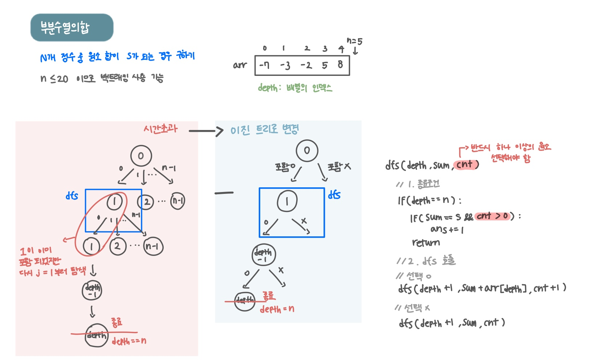

<br>

---

[https://www.acmicpc.net/problem/1182](https://www.acmicpc.net/problem/1182)

---

<br>

# 🔍 문제 풀이

## 문제 도식화



<br>

## 놓친 점

> 처음 아래와 같이 각 원소를 순회하며 현재 원소를 '포함'하고 다음 원소를 '선택'하는 방식으로 코드를 짰음. (for문 + 재귀)

```java
// dfs(int start, int sum, int cnt) {...}
for (int i = start; i < n; i++) {
    dfs(i + 1, sum + arr[i], cnt + 1);
}
```

- 하지만 위 코드는 for문 때문에 같은 깊이(depth)에서 여러 번의 재귀 호출이 발생
- 각 단계에서 여러 개의 '가지'를 뻗어나가기 때문에 탐색하는 경우의 수가 기하급수적으로 늘어나 **시간초과** 발생

<br>

> 따라서 아래와 같이 **이진트리**로 변경

```java
// dfs(int depth, int sum, int cnt) {...}
dfs(depth + 1, sum + arr[depth], cnt + 1); // 현재 원소 포함
dfs(depth + 1, sum, cnt); // 현재 원소 미포함
```

- 각 원소를 단 한 번씩만 고려
- 현재 원소를 **부분 수열에 '포함'할지, '포함하지 않을지'**의 두 가지 경우로만 재귀 함수를 분기

<br>

> 하나 이상의 원소를 포함해야 하므로 **공집합 제외**시켜야함

- DFS로 모든 경우를 탐색할 때, **'아무것도 선택하지 않는 경우'** 가 발생할 수 있음을 항상 고려해야 함
- 즉 하나 이상의 원소를 반드시 선택해야 함
- cnt 변수를 사용해 선택된 원소의 개수를 세어 cnt가 0보다 클 때만 정답처리하여 해결

<br><br>

# 💻 코드

```java
import java.io.*;
import java.util.*;

public class Main {
    static int n, s, ans = 0;

    static int[] arr;

    public static void main(String[] args) throws IOException {
        BufferedReader br = new BufferedReader(new InputStreamReader(System.in));

        StringTokenizer st = new StringTokenizer(br.readLine());
        n = Integer.parseInt(st.nextToken());
        s = Integer.parseInt(st.nextToken());

        arr = new int[n];

        st = new StringTokenizer(br.readLine());
        for(int i=0; i<n; i++){
            arr[i] = Integer.parseInt(st.nextToken());
        }

        dfs(0, 0, 0);
        System.out.println(ans);
    }

    static void dfs(int depth, int sum, int cnt) {
        // 1. 종료조건
        if(depth == n) {
            if(sum == s && cnt > 0) {
                ans += 1;
            }
            return;
        }

        // 2. dfs 호출
        // 선택 o
        dfs(depth + 1, sum + arr[depth], cnt + 1);

        // 선택 x
        dfs(depth + 1, sum, cnt);
    }
}
```

<br>
