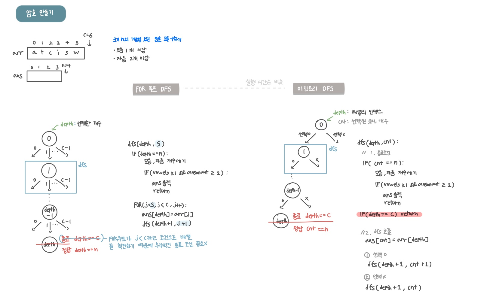

<br>

---

[https://www.acmicpc.net/problem/1759](https://www.acmicpc.net/problem/1759)

---

<br>

# 🔍 문제 풀이

## 문제 도식화

- 조합을 구현할 때는 일반적으로 `v` 배열을 사용하지 않음
- `s` 매개변수만으로도 중복 선택을 피하고 순서에 상관없는 조합을 만들 수 있음
  - `j  +1`로 넘어가기 때문에 이미 뽑은 원소는 다시 안 나옴



> 실행 시간은 비슷


<br>

# 💻 코드

## 이진트리

```java
import java.io.*;
import java.util.*;

public class Main {
    static int c, n;
    static char[] arr;
    static char[] ans;

    public static void main(String[] args) throws IOException {
        BufferedReader br = new BufferedReader(new InputStreamReader(System.in));

        StringTokenizer st = new StringTokenizer(br.readLine());
        n = Integer.parseInt(st.nextToken());
        c = Integer.parseInt(st.nextToken());

        arr = new char[c];
        ans = new char[n];

        st = new StringTokenizer(br.readLine());
        for (int i = 0; i < c; i++) {
            arr[i] = st.nextToken().charAt(0);
        }

        Arrays.sort(arr);

        dfs(0, 0);
    }

    static void dfs(int depth, int cnt) {
        // 1. 종료 조건
        if(cnt == n){
            if(isValid()){
                for(char val:ans){
                    System.out.print(val);
                }
                System.out.println();
            }
            return;
        }
        if(depth == c) return;

        // 2. dfs 호출
        ans[cnt] = arr[depth];

        // 선택 o
        dfs(depth + 1, cnt + 1);

        // 선택 x
        dfs(depth + 1, cnt);
    }

    static boolean isValid(){
        int vowels = 0;
        int consonant = 0;

        // 모음, 자음 개수 세기
        for(char val:ans){
            if(val == 'a' || val == 'e' || val == 'i' || val == 'o' || val == 'u') vowels ++;
            else consonant ++;
        }

        return vowels >= 1 && consonant >= 2;
    }
}
```

<br>

## for 루프

for 루프가 `j < c`라는 조건으로 이미 배열의 끝을 확인하므로 추가적인 종료 조건이 필요 없다.

```java
import java.io.*;
import java.util.*;

public class Main {
    static int c, n;
    static char[] arr;
    static char[] ans;

    public static void main(String[] args) throws IOException {
        BufferedReader br = new BufferedReader(new InputStreamReader(System.in));

        StringTokenizer st = new StringTokenizer(br.readLine());
        n = Integer.parseInt(st.nextToken());
        c = Integer.parseInt(st.nextToken());

        arr = new char[c];
        ans = new char[n];

        st = new StringTokenizer(br.readLine());
        for (int i = 0; i < c; i++) {
            arr[i] = st.nextToken().charAt(0);
        }

        Arrays.sort(arr);

        dfs(0, 0);
    }

    static void dfs(int depth, int s) {
        // 1. 종료 조건
        if(depth == n){
            if(isValid()){
                for(char val:ans){
                    System.out.print(val);
                }
                System.out.println();
            }
            return;
        }
        if(depth == c) return; // 생략 가능

        // 2. dfs 호출
        for (int j = s; j < c; j++) {
            ans[depth] = arr[j];
            dfs(depth + 1, j + 1);
        }
    }

    static boolean isValid(){
        int vowels = 0;
        int consonant = 0;

        // 모음, 자음 개수 세기
        for(char val:ans){
            if(val == 'a' || val == 'e' || val == 'i' || val == 'o' || val == 'u') vowels ++;
            else consonant ++;
        }

        return vowels >= 1 && consonant >= 2;
    }
}
```

<br>
