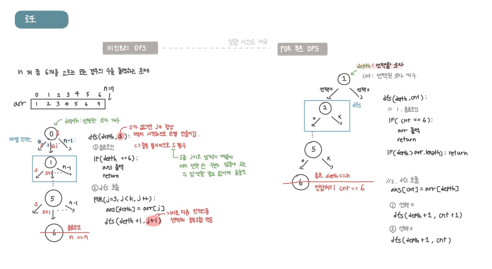

<br>

---

[https://www.acmicpc.net/problem/6603](https://www.acmicpc.net/problem/6603)

---

<br>

# 🔍 문제 풀이

## 문제 도식화



<br>

> 실행시간


🤖 with GPT


<br>

# 💻 코드

## FOR 루프 DFS

```java
import java.io.*;
import java.util.*;

public class Main {
    static int n;
    static int[] arr;
    static int[] ans;

    public static void main(String[] args) throws IOException {
        BufferedReader br = new BufferedReader(new InputStreamReader(System.in));


        while(true){
            StringTokenizer st = new StringTokenizer(br.readLine());
            n = Integer.parseInt(st.nextToken());

            if(n == 0) break;

            arr = new int[n];
            ans = new int[6];

            for(int i = 0; i< n; i++){
                arr[i] = Integer.parseInt(st.nextToken());
            }

            dfs(0, 0);
            System.out.println();
        }
    }

    static void dfs(int depth, int s) {
        // 1. 종료조건
        if(depth == 6){
            for(int val:ans){
                System.out.print(val + " ");
            }
            System.out.println();
            return;
        }

        // 2. dfs 호출
        for(int j = s; j< n; j++){
            ans[depth] = arr[j];
            dfs(depth + 1, s + 1);
        }
    }
}
```

<br>

## 이진트리 DFS

```java
import java.io.*;
import java.util.*;

public class Main {
    static int k;
    static int[] arr;
    static int[] ans;

    public static void main(String[] args) throws IOException {
        BufferedReader br = new BufferedReader(new InputStreamReader(System.in));


        while(true){
            StringTokenizer st = new StringTokenizer(br.readLine());
            k = Integer.parseInt(st.nextToken());

            if(k == 0) break;

            arr = new int[k];
            for (int i = 0; i < k; i++) {
                arr[i] = Integer.parseInt(st.nextToken());
            }


            ans = new int[6];


            dfs(0, 0);
            System.out.println();
        }
    }

    static void dfs(int depth, int cnt) {
        // 1. 종료조건
        if(cnt == 6){
            for(int val : ans){
                System.out.print(val + " ");
            }
            System.out.println();
            return;
        }

        if (k - depth < 6 - cnt) return;

        // 2. dfs 호출
        ans[cnt] = arr[depth];
        // 선택 o
        dfs(depth + 1, cnt + 1);

        // 선택 x
        dfs(depth + 1, cnt);
    }
}

```

<br>
