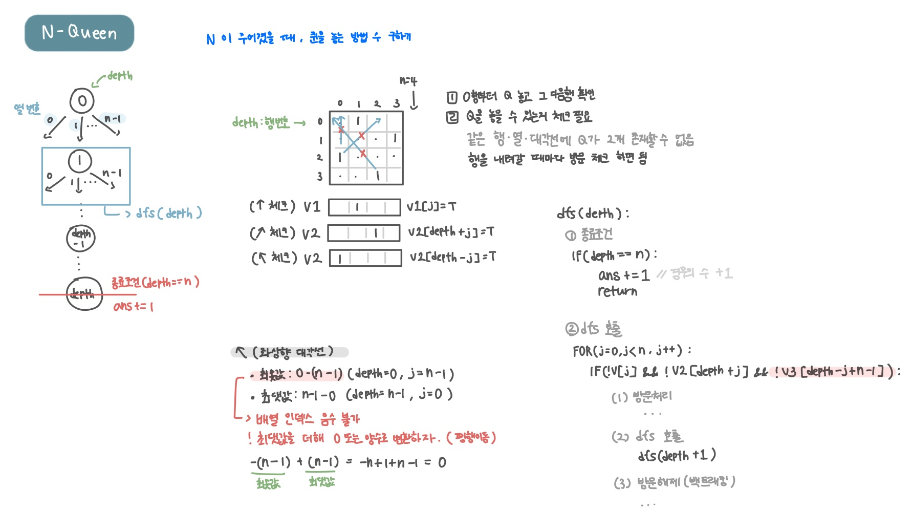

<br>

---

[https://www.acmicpc.net/problem/9663](https://www.acmicpc.net/problem/9663)

---

<br>

# 🔍 문제 풀이

## 풀이 방법

> 퀸 공격 범위

- 퀸은 가로, 세로, 그리고 두 방향의 대각선으로 공격할 수 있다.
- 각 행에 퀸을 하나씩 놓기 때문에, 가로(행)는 별도로 체크할 필요가 없다.
- 따라서 **세로(열)**와 두 대각선만 체크하면 된다.

<br>

> 방문 처리

| 배열     | 역할             | 크기     | 인덱스              | 설명                                                                                                                                         |
| -------- | ---------------- | -------- | ------------------- | -------------------------------------------------------------------------------------------------------------------------------------------- |
| **`v1`** | 세로(열) 체크    | `n`      | `j`                 | 체스판에 $n$개의 열이 있어, 각 열에 퀸이 놓였는지 여부를 저장                                                                                |
| **`v2`** | 우상향 대각선(↗) | `2n - 1` | `depth + j`         | - 행과 열의 합($\text{depth} + \text{j}$)이 같은 칸들이 같은 대각선에 있음. <br> - 총 $2n-1$개의 대각선이 존재 (0부터 2n−2((n−1)+(n−1))까지) |
| **`v3`** | 좌상향 대각선(↖) | `2n - 1` | `depth - j + n - 1` | - 행에서 열을 뺀 값($\text{depth} - \text{j}$)이 같은 칸들이 같은 대각선에 있음<br> - 음수 인덱스를 피하기 위해 $n-1$을 더해 양수로 만듬     |

<br>

## 문제 도식화



<br><br>

# 💻 코드

```java
import java.io.*;
import java.util.*;

public class Main {
    static int n, ans = 0;
    static boolean[] v1; // ↑ (열) 체크
    static boolean[] v2; // ↗ 체크
    static boolean[] v3; // ↖ 체크

    public static void main(String[] args) throws IOException {
        BufferedReader br = new BufferedReader(new InputStreamReader(System.in));

        n = Integer.parseInt(br.readLine());
        v1 = new boolean[ n];
        v2 = new boolean[2 * n - 1];
        v3 = new boolean[2 * n - 1];

        dfs(0);
        System.out.println(ans);
    }

    static void dfs(int depth) {
        // 1. 종료 조건
        if(depth == n){
           ans += 1;
           return;
        }

        // 2. dfs 호출
        for(int j=0; j<n; j++){
            // ↑, ↗, ↖ 전부 T면 Q 놔도 됨
            if (!v1[j] && !v2[depth + j] && !v3[depth - j + n - 1]){
                v1[j] = v2[depth + j] = v3[depth - j + n - 1] = true;

                dfs(depth + 1);

                v1[j] = v2[depth + j] = v3[depth - j + n - 1] = false;
            }

        }
    }
}
```

<br>
