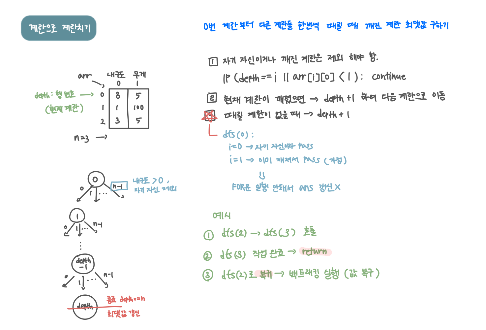

<br>

---

[https://www.acmicpc.net/problem/16987](https://www.acmicpc.net/problem/16987)

---

<br>

# 🔍 문제 풀이

## 문제 도식화



<br>

# 💻 코드

```java
import java.io.*;
import java.util.*;

public class Main {
    static int n;
    static int[][] arr;
    static int ans = 0;

    public static void main(String[] args) throws IOException {
        BufferedReader br = new BufferedReader(new InputStreamReader(System.in));

        StringTokenizer st = new StringTokenizer(br.readLine());
        n = Integer.parseInt(st.nextToken());

        arr = new int[n][2];

        for(int i=0; i<n; i++){
            st = new StringTokenizer(br.readLine());
            arr[i][0] = Integer.parseInt(st.nextToken()); // 내구도
            arr[i][1] = Integer.parseInt(st.nextToken()); // 무게
        }

        dfs(0);
        System.out.println(ans);
    }

    static void dfs(int depth) {
        // 1. 종료 조건
        if(depth == n) {
            int cnt = 0;
            for(int i=0; i<n; i++){
                if(arr[i][0] < 1) cnt ++;
            }
            ans = Math.max(ans, cnt);
            return;
        }

        // 2. 가지치기
        // 때릴 계란 없는지 체크
        boolean canBroken = false;
        for(int i=0; i<n; i++){
            if(i != depth && arr[i][0] > 0){
                canBroken = true;
                break;
            }
        }

        // 현재 계란 깨졌거나 때릴 달걀이 없으면 다음 계란으로
        if(arr[depth][0] < 1 || !canBroken){
            dfs(depth + 1); // 다음 계란으로
            return;
        }

        // 2. dfs 호출
        for (int i = 0; i < n; i++) {
            // 자기 자신, 깨진 계란 제외
            if(depth == i || arr[i][0] < 1) continue;

            // 계란 깨기
            arr[depth][0] -= arr[i][1];
            arr[i][0] -= arr[depth][1];

            dfs(depth + 1); // 다음 계란

            // 백트래킹
            arr[depth][0] += arr[i][1];
            arr[i][0] += arr[depth][1];
        }
    }
}
```

<br>
