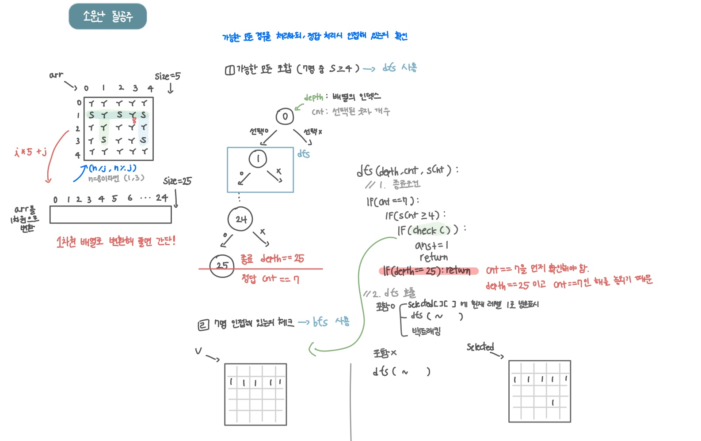

<br>

---

[https://www.acmicpc.net/problem/1941](https://www.acmicpc.net/problem/1941)

---

<br>

# 🔍 문제 풀이

## 문제 도식화




<br>

## 문제 해결 포인트 💡

> 2차원 배열을 1차원으로 다루기

1.  5x5 2차원 격자를 25개의 칸으로 이루어진 1차원 배열처럼 생각하면 문제를 더 간단하게 풀 수 있다.
2.  `(r, c)` 좌표는 `r * 5 + c`라는 인덱스로 변환할 수 있다

<br>

> 문제를 크게 두 가지 하위 문제로 나누기

① 7명의 학생 조합 찾기 (DFS)

- 25개의 자리 중 7개를 선택하는 모든 조합 탐색
- `S` 가 4명 이상인 경우만 BFS 호출해 인접체크

<br>

② 7명 인접 체크 (BFS)

- 1단계에서 dfs로 선택된 7명의 학생이 서로 연결되어 있는지 확인
- 이를 위해 `selected` 배열을 사용하여 선택된 7명의 학생 위치를 표시하고, 이 배열을 바탕으로 BFS를 수행
- BFS를 사용해 7명이 모두 연결되어 있는지 확인
- 연결된 학생 수가 7명이면 유효한 조합이므로 `ans ++`

<br>

-- 문어박사님 설명 정말 잘해주신다. [[문어박사님 설명 보기]](https://www.youtube.com/watch?v=DWdFSOehwFI&list=PLodgw23vNd_UFQeV8GQtVHrT38VWE6iJv&index=17) --

<br>

# 💻 코드

## 이진트리 DFS

```java
import java.io.*;
import java.util.*;

public class Main {
    static char[][] arr;
    static int[][] selected; // 선택된 자리 저장
    static int[][] v; // bfs 방문표시

    static int ans = 0;
    static int[] dx = {-1, 1, 0, 0};
    static int[] dy = {0, 0, -1, 1};

    public static void main(String[] args) throws IOException {
        BufferedReader br = new BufferedReader(new InputStreamReader(System.in));

        arr = new char[5][5];
        selected = new int[5][5];

        for(int i=0; i<5; i++) {
            String line = br.readLine();
            for (int j = 0; j < 5; j++) {
                arr[i][j] = line.charAt(j);
            }
        }

        dfs(0, 0, 0);
        System.out.println(ans);
    }

    static void dfs(int depth, int cnt, int sCnt) {
        // 0. 가지치기 -> 이미 7명 넘었으면 불가
        if(cnt > 7) return;

        // 1. 종료 조건
        if(cnt == 7) {
            if(sCnt >= 4) {
                // 7명 인접해있는지 체크
                if (check()) {
                    ans += 1;
                }
            }
            return;
        }
        if(depth == 25) return;


        // 2. dfs 호출
        // 포함 o
        int x = depth / 5;
        int y = depth % 5;
        selected[x][y] = 1; // 현재레벨 1로 방문표시
        dfs(depth + 1, cnt + 1, sCnt + (arr[x][y] == 'S' ? 1 : 0));
        selected[x][y] = 0; // 백트래킹

        // 포함 x
        dfs(depth + 1, cnt, sCnt);
    }

    // bfs로 7명 인접 체크
    static boolean check(){
        for(int i=0; i<5; i++){
            for(int j=0; j<5; j++){
                if(selected[i][j] == 1){
                    return bfs(i, j);
                }
            }
        }
        return false;
    }

    static boolean bfs(int x, int y) {
        // 1. 초기화
        Deque<int[]> dq = new ArrayDeque<>();
        v = new int[5][5];
        int cnt = 1;

        // 2. 초기값
        dq.offer(new int[]{x, y});
        v[x][y] = 1;


        // 3. 탐색
        while(!dq.isEmpty()) {
            int[] cur = dq.poll();
            int cx = cur[0];
            int cy = cur[1];

            // 3-1. 4방향
            for(int d = 0; d < 4; d ++){
                int nx = cx + dx[d];
                int ny = cy + dy[d];

                // 3-2. 범위 내
                if(nx < 0 || nx >= 5 || ny < 0 || ny >= 5) continue;

                // 3-3. 미방문 + 선택 칸만 이동
                if(v[nx][ny] == 0 && selected[nx][ny] == 1){
                    dq.offer(new int[]{nx, ny});
                    v[nx][ny] = 1;

                    cnt += 1;
                }
            }
        }

        return cnt == 7;
    }
}
```

<br>

## FOR 루프 DFS

```java

...

static void dfs(int depth, int cnt, int sCnt) {
    // 0. 가지치기 -> 이미 7명 넘었으면 불가
    if (cnt > 7) return;

    // 1. 종료 조건
    if (cnt == 7) {
        if (sCnt >= 4) {
            // 7명 인접해있는지 체크
            if (check()) {
                ans += 1;
            }
        }
        return;
    }
    if (depth == 25) return;

    // 2. dfs 호출
    for (int i = depth; i < 25; i++) {
        int r = i / 5;
        int c = i % 5;

        selected[r][c] = 1;
        dfs(i + 1, cnt + 1, sCnt + (arr[r][c] == 'S' ? 1 : 0));
        selected[r][c] = 0; // 백트래킹
    }
}

...

```

<br>
