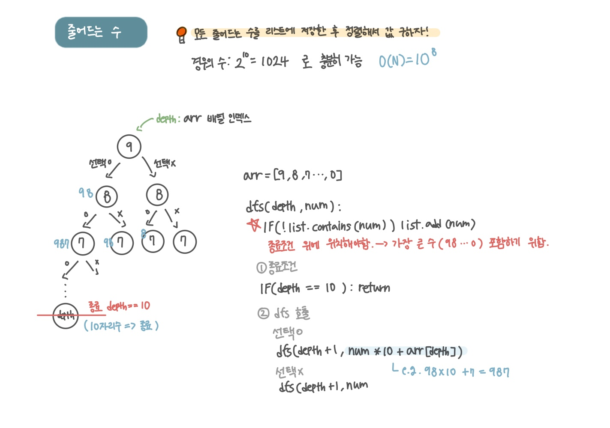

<br>

---

[https://www.acmicpc.net/problem/1174](https://www.acmicpc.net/problem/1174)

---

<br>

# 🔍 문제 풀이

## 문제 도식화

> 모든 줄어드는 수를 리스트에 저장한 후, 리스트를 정렬하여 N번째 수를 찾는다.

- 줄어들 수 있는 총 개수는 0부터 9876543210 (최대 10자리)까지로 `long` 형 타입을 사용하면 2^10(1024) 개 숫자를 저장할 수 있다.
- 아이디어가 안 떠올라 [[다른 사람의 블로그]](https://dingdingmin-back-end-developer.tistory.com/entry/%EB%B0%B1%EC%A4%80-1174%EC%9E%90%EB%B0%94-java-%EC%A4%84%EC%96%B4%EB%93%9C%EB%8A%94-%EC%88%98) 를 참고하여 풀이하였다.
- [감소하는 수 (BOJ 1038)](https://www.acmicpc.net/problem/1038) 문제랑 매우 유사하다. (1-based, 0-based 차이)



<br>

# 💻 코드

- 이 문제는 `1-based` 이므로 `list.get(n - 1)` -> 출력 `if(n > list.size())`
- [참고] [감소하는 수](https://www.acmicpc.net/problem/1038) 문제는 `0-based` 이므로 `list.get(n)` - > 으로 출력 `if(n >= list.size())`

```java
import java.io.*;
import java.util.*;

public class Main {
    static int n;
    static int [] arr = {9,8,7,6,5,4,3,2,1,0};
    static List<Long> list = new ArrayList<>();

    public static void main(String[] args) throws IOException {
        BufferedReader br = new BufferedReader(new InputStreamReader(System.in));
        n = Integer.parseInt(br.readLine());

        dfs(0,0);

        Collections.sort(list);

        if(n > list.size()) System.out.println(-1);
        else System.out.println(list.get(n - 1));

    }

    // depth : arr 배열 인덱스
    static void dfs(int depth, long num) {
        // ⭐ 종료 조건 위에서 값 추가
        if(!list.contains(num)) list.add(num);

        // 1. 종료 조건
        if(depth == 10) return;

        // 2. dfs 호출
        // 선택 o
        dfs(depth + 1, num * 10 + arr[depth]);

        // 선택 x
        dfs(depth + 1, num);
    }
}
```

<br>
