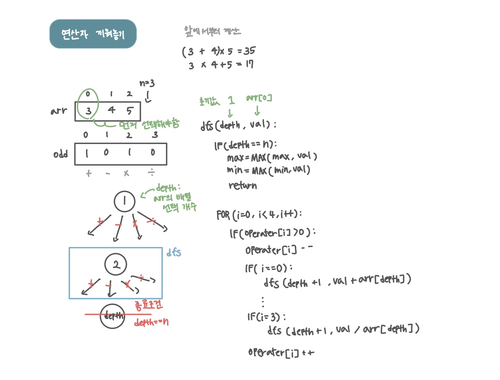

<br>

---

[https://www.acmicpc.net/problem/14888](https://www.acmicpc.net/problem/14888)

---

<br>

# 🔍 문제 풀이

## 문제 도식화

1. 호출이 종료되어 return되면, 코드는 다시 dfs 함수 내부의 for 반복문이 실행되던 지점으로 돌아옴
2. `operator[i]++` 로연산자 개수 복구
3. for 반복문은 다음 i로 넘어감. (예: i`=0`에서 `i=1`로)
4. `i=1`일 때 다시 if 조건을 확인하고, 조건이 참이면 다음 재귀 호출을 통해 새로운 경로를 탐색

<br>

# 💻 코드

```java
import java.io.*;
import java.util.*;

public class Main {
    static int n;
    static int[] arr;
    static int[] operator;
    static int min = Integer.MAX_VALUE;
    static int max = Integer.MIN_VALUE;

    public static void main(String[] args) throws IOException {
        BufferedReader br = new BufferedReader(new InputStreamReader(System.in));
        n = Integer.parseInt(br.readLine());
        arr = new int[n];
        operator = new int[4];

        StringTokenizer st = new StringTokenizer(br.readLine());
        for(int i=0; i<n; i++){
            arr[i] = Integer.parseInt(st.nextToken());
        }

        st = new StringTokenizer(br.readLine());
        for(int i=0; i<4; i++){
            operator[i] = Integer.parseInt(st.nextToken());
        }

        dfs(1, arr[0]);

        System.out.println(max);
        System.out.println(min);
    }

    static void dfs(int depth, int val){
        // 1. 종료조건
        if(depth == n){
            max = Math.max(max, val);
            min = Math.min(min, val);
            return;
        }

        // 2. dfs 호출
        for(int i=0; i<4; i++){
            if(operator[i] > 0) { // 연산자 남아있다면

                operator[i] --;

                if(i == 0) dfs(depth + 1, val + arr[depth]);
                else if(i == 1) dfs(depth + 1, val - arr[depth]);
                else if(i == 2) dfs(depth + 1, val * arr[depth]);
                else if(i == 3) dfs(depth + 1, val / arr[depth]);

                operator[i] ++; // 백트래킹
            }
        }
    }
}
```

<br>
