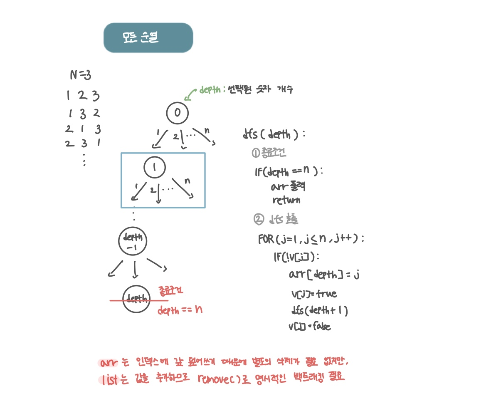

<br>

---

[https://www.acmicpc.net/problem/10974](https://www.acmicpc.net/problem/10974)

---

<br>

# 🔍 문제 풀이

## 문제 도식화



<br>

## 알게된 점

> 배열을 사용한 백트래킹

- `arr[depth] = j;`와 같이 `depth` 인덱스 새로운 값을 덮어씌운다.
- 덮어쓰기 방식이기 때문에 명시적인 복구 과정이 필요 없다.

<br>

> 리스트를 사용한 백트래킹

- `list.add(j)`를 사용해 리스트의 맨 뒤에 값을 추가하다.
- 재귀 호출이 끝난 뒤, `list.remove(list.size() - 1);`를 사용해 마지막에 추가했던 값을 명시적으로 제거해야 한다.

# 💻 코드

## 배열 사용

```java
import java.io.*;
import java.util.*;

public class Main {
    static int n;
    static boolean[] v;
    static int[] arr;

    public static void main(String[] args) throws IOException {
        BufferedReader br = new BufferedReader(new InputStreamReader(System.in));
        n = Integer.parseInt(br.readLine());
        arr = new int[n];
        v = new boolean[n+1];

        dfs(0);
    }

    static void dfs(int depth){
        // 1. 종료 조건
        if(depth == n){
            for(int val:arr){
                System.out.print(val + " ");
            }
            System.out.println();
            return;
        }

        // 2. dfs 탐색
        for(int j=1; j<=n; j++){
            if(!v[j]){
                arr[depth] = j;
                v[j] = true;

                dfs(depth + 1);

                v[j] = false;
            }
        }
    }
}
```

<br>

## 리스트 사용

```java
import java.io.*;
import java.util.*;

public class Main {
    static int n;
    static boolean[] v;
    static List<Integer> list = new ArrayList<>();

    public static void main(String[] args) throws IOException {
        BufferedReader br = new BufferedReader(new InputStreamReader(System.in));
        n = Integer.parseInt(br.readLine());
        v = new boolean[n+1];

        dfs(0);
    }

    static void dfs(int depth){
        // 1. 종료 조건
        if(depth == n){
            for(int val:list){
                System.out.print(val + " ");
            }
            System.out.println();
            return;
        }

        // 2. dfs 탐색
        for(int j=1; j<=n; j++){
            if(!v[j]){
                list.add(j);
                v[j] = true;

                dfs(depth + 1);

                v[j] = false;
                list.remove(list.size() - 1); // 마지막 요소 명시적 제거
            }
        }
    }
}
```

<br>
