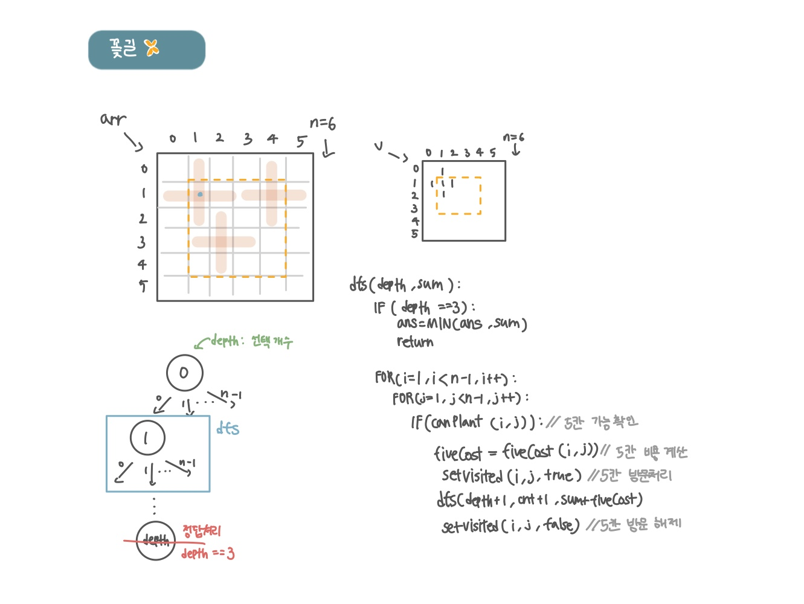

<br>

---

[https://www.acmicpc.net/problem/14620](https://www.acmicpc.net/problem/14620)

---

<br>

# 🔍 문제 풀이

## 문제 도식화

> 꽃의 5칸을 한 묶음으로 처리해야한다.

처음엔 꽃잎 한 칸을 처리할 때마다 바로 재귀 함수를 호출했지만,<br>
꽃의 5칸 모두를 방문 처리하고 비용을 계산한 후에 재귀 호출을 해야함

한 번에 방문처리하기 5칸을 한 번에 방문 처리하는 방식으로 해결



<br>

# 💻 코드

```java
import java.io.*;
import java.util.*;

public class Main {
    static int[][] arr;
    static boolean[][] v;
    static int n;
    static int ans = Integer.MAX_VALUE;

    static int[] dx = {-1, 1, 0, 0};
    static int[] dy = {0, 0, -1, 1};

    public static void main(String[] args) throws IOException {
        BufferedReader br = new BufferedReader(new InputStreamReader(System.in));
        n = Integer.parseInt(br.readLine());
        arr = new int[n][n];
        v = new boolean[n][n];

        for (int i = 0; i < n; i++) {
            StringTokenizer st = new StringTokenizer(br.readLine());
            for (int j = 0; j < n; j++) {
                arr[i][j] = Integer.parseInt(st.nextToken());
            }
        }

        dfs(0, 0);
        System.out.println(ans);
    }

    static void dfs(int depth, int sum){
        // 1. 종료조건
        if(depth == 3){
            ans = Math.min(ans, sum);
            return;
        }

        // 2. 탐색
        for(int i=1; i<n-1; i++){
            for(int j=1; j<n-1; j++){
                if(isValid(i, j)){ // 5칸 가능 확인
                    int cost = getCost(i,j); // 5칸 비용 계산

                    setVisited(i, j, true); // 5칸 방문 처리
                    dfs(depth + 1, sum + cost);
                    setVisited(i, j, false); // 5칸 방문 해제
                }

            }
        }
    }

    // 5칸 가능한지 확인
    static boolean isValid(int x, int y){
        if(v[x][y]) return false;
        for(int d=0; d<4; d++){
            int nx = x + dx[d];
            int ny = y + dy[d];

            if(v[nx][ny]) return false;
        }

        return true;
    }

    // 5칸 비용 계산
    static int getCost(int x, int y){
        int cost = arr[x][y];

        for(int d=0; d<4; d++){
            int nx = x + dx[d];
            int ny = y + dy[d];

            cost += arr[nx][ny];
        }

        return cost;
    }

    // 5칸 방문 처리 및 백트래킹
    static void setVisited(int x, int y, boolean flag){
        v[x][y] = flag;
        for(int d=0; d<4; d++){
            int nx = x + dx[d];
            int ny = y + dy[d];

            v[nx][ny] = flag;
        }
    }
}
```

<br>
