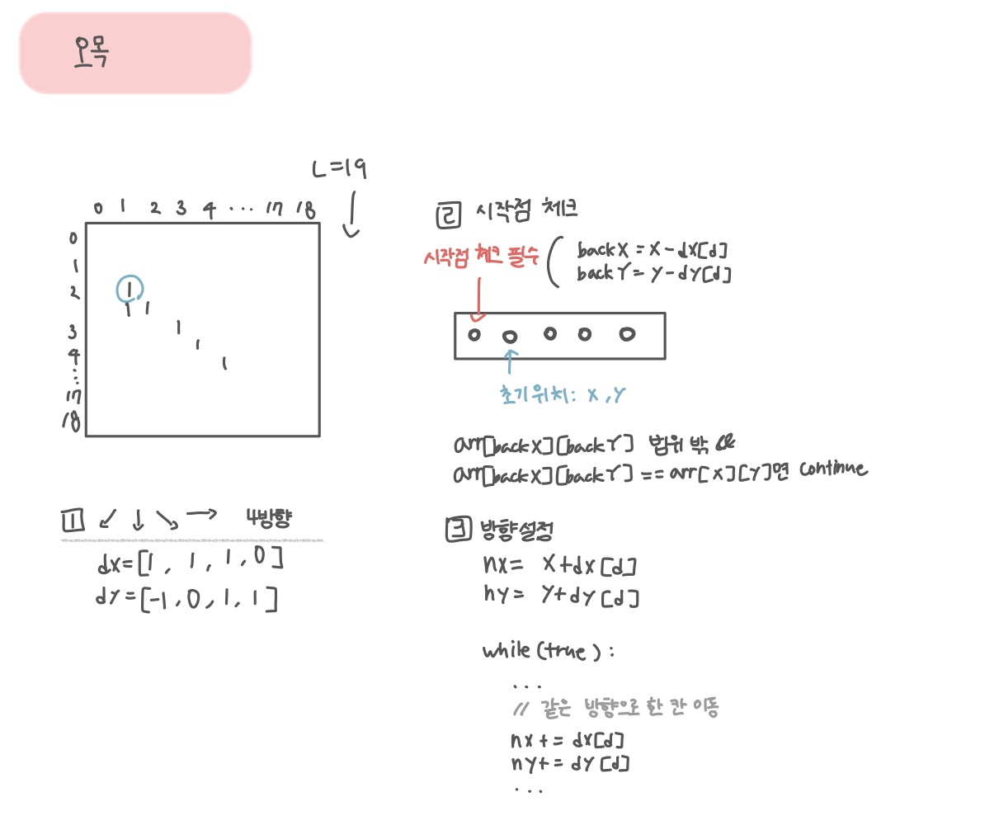

<br>

---

[https://www.acmicpc.net/problem/2615](https://www.acmicpc.net/problem/2615)

---

<br>

# 🔍 문제 풀이

## 문제 도식화



<br>

## 놓친점

> 시작점 검증을 해야한다.

- 시작점을 검증하지 않으면 6목 이상의 중간 지점도 5개가 나오기 때문에 오검출이 생긴다.
- 그래서 현재 돌 (x,y)가 연속 구간의 맨 처음 돌인지 확인해야 한다.

<br>

> 시작점 검증하는 방법

- 반대 방향에 같은 색이 있으면 시작점이 아니다.
- 현재 위치 (x,y)가 있으면, 그 돌 기준으로 탐색하려는 방향의 반대쪽 한 칸 (`x - dx[d], y - dy[d]`)을 확인해야 한다.
- 반대편 한 칸에 같은색 돌이 있으면 -> 시작점 아니므로 `continue`

```java
int backX = x - dx[d];
int backY = y - dy[d];

if (0 <= px && px < 19 && 0 <= py && py < 19 && arr[px][py] == color) continue; // 시작점 아님
```

<br>

# 💻 코드

```java
import java.io.*;
import java.util.*;

public class Main {
    static int[][] arr = new int[19][19];
    // →, ↓, ↘, ↗
    static int[] dx = {0, 1, 1, -1};
    static int[] dy = {1, 0, 1, 1};

    public static void main(String[] args) throws IOException {
        BufferedReader br = new BufferedReader(new InputStreamReader(System.in));
        for (int i = 0; i < 19; i++) {
            StringTokenizer st = new StringTokenizer(br.readLine());
            for (int j = 0; j < 19; j++) {
                arr[i][j] = Integer.parseInt(st.nextToken());
            }
        }

        for (int i = 0; i < 19; i++) {
            for (int j = 0; j < 19; j++) {
                if (arr[i][j] == 0) continue;
                if (solve(i, j)) {
                    System.out.println(arr[i][j]);
                    System.out.println((i + 1) + " " + (j + 1));
                    return;
                }
            }
        }
        System.out.println(0);
    }

    static boolean solve(int x, int y) {
        int color = arr[x][y]; // 첫 바둑알 색 저장

        for(int d = 0; d < 4; d++){
            // 시작점 확인
            int backX = x - dx[d];
            int backY = y - dy[d];

            if(isValid(backX, backY) && arr[backX][backY] == color) continue;

            int cnt = 1;

            // 방향 설정 (d방향으로 한 칸 이동)
            int nx = x + dx[d];
            int ny = y + dy[d];

            // 연속된 돌 수 개수 세기
            while(true){
                if(!isValid(nx, ny)) break;
                if (cnt >= 6) break; // 가지치기
                if(arr[nx][ny] != color) break;
                cnt++;

                // 같은 방향으로 한 칸 이동
                nx += dx[d];
                ny += dy[d];
            }

            if(cnt == 5) return true;
        }

        return false;
    }

    static boolean isValid(int x, int y) {
        return 0 <= x && x < 19 && 0 <= y && y < 19;
    }
}
```

<br>
