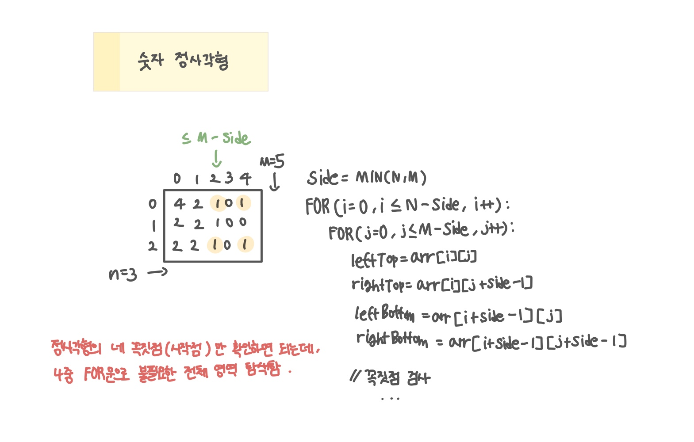

<br>

---

[https://www.acmicpc.net/problem/1051](https://www.acmicpc.net/problem/1051)

---

<br>

# 🔍 문제 풀이

## 문제 도식화



<br>

# 💻 코드

```java
import java.io.*;
import java.util.*;

public class Main {
    static int[][] arr;
    static int n, m;

    public static void main(String[] args) throws Exception {
        BufferedReader br = new BufferedReader(new InputStreamReader(System.in));

        StringTokenizer st = new StringTokenizer(br.readLine());
        n = Integer.parseInt(st.nextToken());
        m = Integer.parseInt(st.nextToken());

        arr = new int[n][m];
        for(int i=0; i<n; i++){
            String line = br.readLine();
            for(int j = 0; j<m; j++){
                arr[i][j] = line.charAt(j) - '0';
            }
        }

        int ans = solve();
        System.out.println(ans * ans);
    }

    static int solve() {
        int maxSide = Math.min(n, m);

        while(maxSide > 0){
            for (int i = 0; i <= n - maxSide; i++) {
                for (int j = 0; j <= m - maxSide; j++) {
                    int topLeft = arr[i][j];
                    int topRight = arr[i][j + maxSide - 1];
                    int bottomLeft = arr[i + maxSide - 1][j];
                    int bottomRight = arr[i + maxSide - 1][j + maxSide - 1];

                    if (topLeft == topRight && topLeft == bottomLeft && topLeft == bottomRight) {
                        return maxSide;
                    }
                }
            }
            maxSide--;
        }

        return 0;
    }
}
```

<br>
