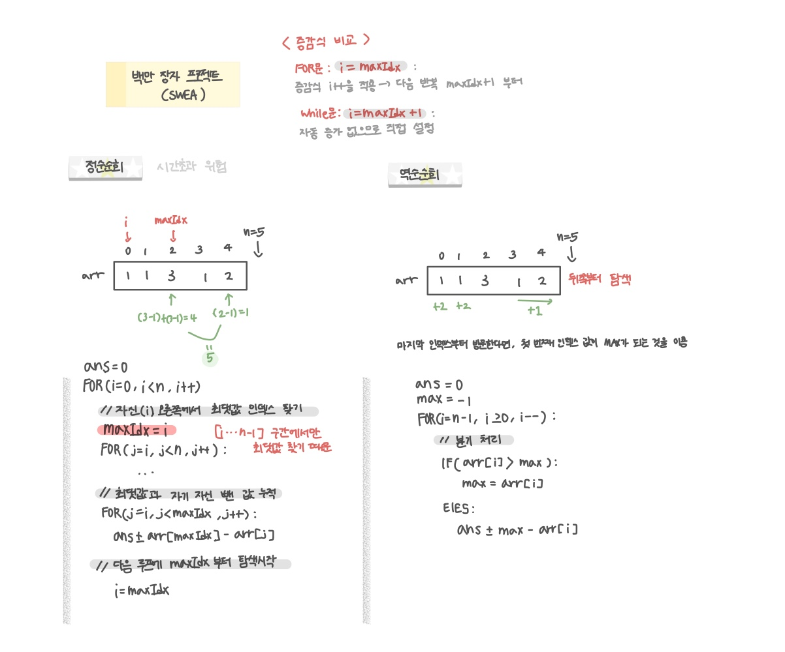

<br>

---

[1859. 백만 장자 프로젝트](https://swexpertacademy.com/main/code/problem/problemDetail.do?contestProbId=AV5LrsUaDxcDFAXc&categoryId=AV5LrsUaDxcDFAXc&categoryType=CODE&problemTitle=&orderBy=FIRST_REG_DATETIME&selectCodeLang=ALL&select-1=&pageSize=10&pageIndex=2)

---

<br>
 
# 🔍 문제 풀이

## 문제 도식화

역순으로 순회하면 쉽게 풀 수 있는데...



> for문과 while문 둘 다 `maxIdx` 다음 칸 부터 보지만, 아래와 같은 차이점이 존재한다.

- for문:
  - `i = maxIdx;` 한 뒤 바로 증감식 `i++`가 적용되어 다음 반복은 `maxIdx + 1`부터 시작
  - for문에서 `i = maxIdx + 1;` 하면 그 뒤 `i++`까지 더해져 `maxIdx + 2`로 건너뛰어져 오류
- while문:
  - 자동 증가가 없으므로 직접 `i = maxIdx + 1;`로 설정해 다음 시작을 `maxIdx + 1`로 이동
  - while문은 `+1`을 직접 더하지 않으면 무한루프로 오류

<br>

# 💻 코드

## 역순 순회

```java
import java.io.*;
import java.util.*;

public class Solution {
    static int[] arr;
    static int n;

    public static void main(String[] args) throws IOException {
        BufferedReader br = new BufferedReader(new InputStreamReader(System.in));

        int t = Integer.parseInt(br.readLine());

        for(int tc=1; tc<=t; tc++){
            n = Integer.parseInt(br.readLine());
            arr = new int[n];

            StringTokenizer st = new StringTokenizer(br.readLine());
            for(int i=0; i<n; i++){
                arr[i] = Integer.parseInt(st.nextToken());
            }


            System.out.print("#" + tc + " ");
            long ans = solve();

            System.out.println(ans);
        }
    }

    static long solve(){
        long ans = 0;
        int max = 0;

        for(int i= n - 1; i >= 0; i--){
            if(arr[i] > max) {
                max = arr[i];
            } else{
                ans += max - arr[i];
            }
        }


        return ans;
    }
}
```

<br>

## 정순 순회

### for문

```java
static long solve() {
    long ans = 0;
    for (int i = 0; i < n; i++) {
        int maxIdx = i;
        for (int j = i + 1; j < n; j++) if (arr[j] > arr[maxIdx]) maxIdx = j;

        for (int j = i; j < maxIdx; ans += arr[maxIdx] - arr[j++]) ;
        i = maxIdx; // 증감식 i++로 인해 다음 i는 maxIdx+1부터
    }
    return ans;
}
```

<br>

### while문

```java
static long solve() {
    long ans = 0;

    int i = 0;
    while (i < n) {
        int maxIdx = i;

        for (int j = i; j < n; j++) {
            if (arr[j] > arr[maxIdx]) {
                maxIdx = j;
            }
        }

        for (int j = i; j < maxIdx; j++) {
            ans += arr[maxIdx] - arr[j];
        }

        i = maxIdx + 1; // 직접 다음 시작 위치로 이동해야 함
    }

    return ans;
}
```

<br>
