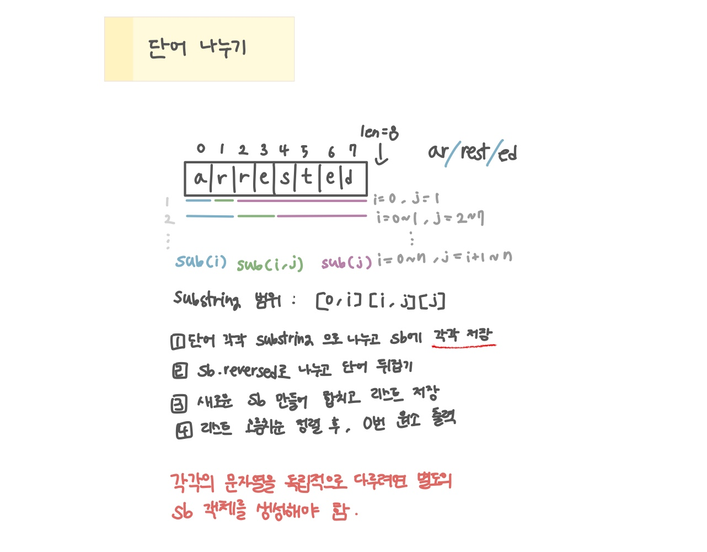

<br>

---

[https://www.acmicpc.net/problem/1251](https://www.acmicpc.net/problem/1251)

---

<br>

# 🔍 문제 풀이

## 문제 도식화



<br>

# 💻 코드

```java
import java.io.*;
import java.util.*;

public class Main {
    public static void main(String[] args) throws IOException {
        BufferedReader br = new BufferedReader(new InputStreamReader(System.in));

        String s = br.readLine();
        List<String> list = new ArrayList<>();

        for (int i = 1; i < s.length(); i++) {
            for (int j = i + 1; j < s.length(); j++) {

                StringBuilder sb1 = new StringBuilder(s.substring(0, i)).reverse();
                StringBuilder sb2 = new StringBuilder(s.substring(i, j)).reverse();
                StringBuilder sb3 = new StringBuilder(s.substring(j)).reverse();

                StringBuilder sb = new StringBuilder();
                sb.append(sb1).append(sb2).append(sb3);
                list.add(sb.toString());
            }
        }

        Collections.sort(list);
        System.out.println(list.get(0));
    }
}
```

<br>
