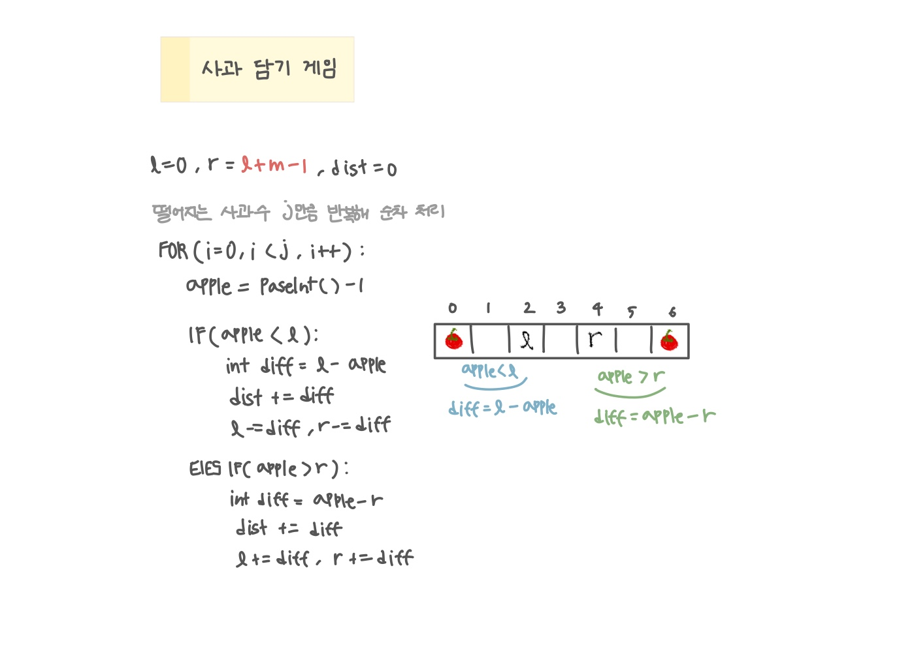

<br>

---

[https://www.acmicpc.net/problem/2828](https://www.acmicpc.net/problem/2828)

---

<br>

# 🔍 문제 풀이

## 문제 도식화



<br>

# 💻 코드

```java
import java.io.*;
import java.util.*;

public class Main {
    public static void main(String[] args) throws IOException {
        BufferedReader br = new BufferedReader(new InputStreamReader(System.in));


        StringTokenizer st = new StringTokenizer(br.readLine());
        int n = Integer.parseInt(st.nextToken());
        int m = Integer.parseInt(st.nextToken());

        int j = Integer.parseInt(br.readLine());

        int l = 0, r = l + m - 1;
        int dist = 0;
        for(int i=0; i<j; i++) {
            int apple = Integer.parseInt(br.readLine()) - 1;

            // 사과 바구니 왼쪽 떨어짐
            if(apple < l){
                int diff = l - apple;
                dist += diff;
                l -= diff;
                r -= diff;
            }

            // 사과 바구니 오른쪽 떨어짐
            else if(apple > r){
                int diff = apple - r;
                dist += diff;
                l += diff;
                r += diff;

            }
        }
        System.out.println(dist);
    }
}
```

<br>
