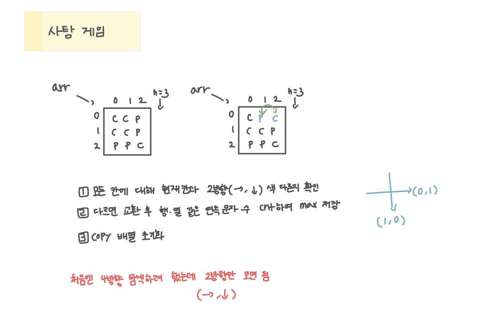

<br>

---

[https://www.acmicpc.net/problem/3085](https://www.acmicpc.net/problem/3085)

---

<br>

# 🔍 문제 풀이

## 문제 도식화



<br>

# 💻 코드

```java
import java.io.*;

public class Main {
    static char[][] arr;
    static int n;
    static int[] dx = {0, 1};
    static int[] dy = {1, 0};
    static int max = 0;

    public static void main(String[] args) throws IOException {
        BufferedReader br = new BufferedReader(new InputStreamReader(System.in));

        n = Integer.parseInt(br.readLine());
        arr = new char[n][n];

        for(int i=0; i<n; i++){
            String line = br.readLine();
            for(int j=0; j<n; j++){
                arr[i][j] = line.charAt(j);
            }
        }

        solve();
        System.out.println(max);

    }

    static void solve(){
        for(int i=0; i<n; i++){
            for(int j=0; j<n; j++){
                for(int d = 0; d<2; d++){
                    int nx = i + dx[d];
                    int ny = j + dy[d];

                    if(nx < 0 || nx >= n || ny < 0 || ny >=n || arr[i][j] == arr[nx][ny]) continue;

                    // 교환
                    char temp = arr[i][j];
                    arr[i][j] = arr[nx][ny];
                    arr[nx][ny] = temp;

                    check();

                    // 되돌리기
                    temp = arr[i][j];
                    arr[i][j] = arr[nx][ny];
                    arr[nx][ny] = temp;
                }

            }
        }
    }

    static void check(){
        // 행 확인
        for(int i=0; i<n; i++) {
            int rowCol = 1;
            for (int j = 1; j < n; j++) {
                if(arr[i][j-1] == arr[i][j]) rowCol ++;
                else rowCol = 1;

                max = Math.max(max, rowCol);
            }
        }

        // 열 확인
        for(int i=0; i<n; i++) {
            int colCol = 1;
            for (int j = 1; j < n; j++) {
                if(arr[j-1][i] == arr[j][i]) colCol++;
                else colCol = 1;

                max = Math.max(max, colCol);
            }
        }

    }
}
```

<br>
