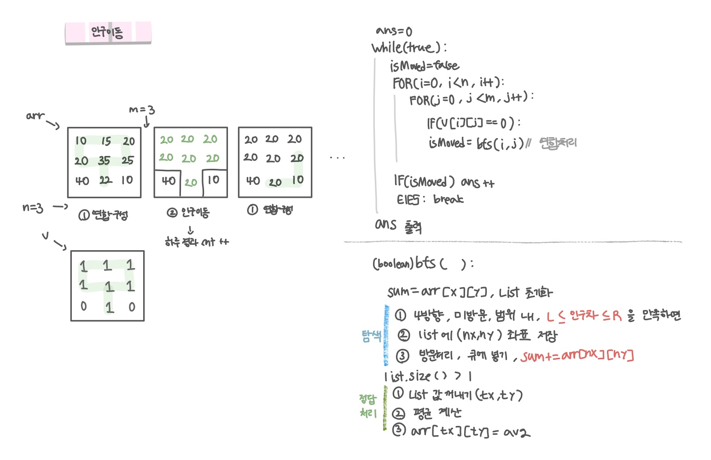

<br>

---

[https://www.acmicpc.net/problem/16918](https://www.acmicpc.net/problem/16918)

---

<br>

# 🔍 문제 풀이

## 문제 도식화

```markdown
조건에 만족하지 않으면 큐에 추가하지 않고 다음 나라를 탐색한다.
조건에 맞을 때만 인구 이동
```



1. 시작점 선택
   - 아직 방문하지 않은(`v[x][y] == 0`) 나라를 하나 선택해 탐색 시작
2. bfs 탐색
   - 선택된 나라를 시작으로 상하좌우 인접한 나라들을 탐색
3. 연합 조건 확인
   - [조건 1] 아직 방문하지 않았을 것 (`v[nx][ny] == 0`)
   - [조건 2] 인구차이 조건 만족 (`l <= abs(현재인구 - 이웃인구) <=r)`)
4. 연합 추가
   - 두 조건 만족하는 이웃 나라 `list`에 추가, `v` 방문표시
5. 탐색 반복 (연합 모든 나라 찾을 때까지)
   - 큐에 다음 탐색할 나라 추가

<br>

# 💻 코드

## 전체 코드

```java
import java.io.*;
import java.util.*;

public class Main {
    static int n, l, r;

    static int[][] arr;
    static int[][] v;


    static int[] dx = {-1, 1, 0, 0};
    static int[] dy = {0, 0, -1, 1};

    public static void main(String[] args) throws IOException {
        BufferedReader br = new BufferedReader(new InputStreamReader(System.in));

        StringTokenizer st = new StringTokenizer(br.readLine());
        n = Integer.parseInt(st.nextToken());
        l = Integer.parseInt(st.nextToken());
        r = Integer.parseInt(st.nextToken());

        arr = new int[n][n];

        for(int i=0; i<n; i++){
            st = new StringTokenizer(br.readLine());
            for(int j=0; j<n; j++){
                arr[i][j] = Integer.parseInt(st.nextToken());
            }
        }

        int ans = 0;

        while(true) {
            v = new int[n][n];
            boolean isMoved = false;

            for(int i=0; i<n; i++){
                for(int j=0; j<n; j++) {
                    if(v[i][j] == 0) {
                        if(bfs(i, j)) {
                            isMoved = true;
                        }
                    }
                }
            }
            if(!isMoved) break;
            else ans ++;
        }


        System.out.println(ans);


    }

    static boolean bfs(int x, int y) {
        // 1. 초기화
        Deque<int[]> dq = new ArrayDeque<>();
        List<int[]> union = new ArrayList<>(); // 연합 좌표
        int sum = arr[x][y]; // 합계

        // 2. 초기값
        dq.offer(new int[]{x, y});
        v[x][y] = 1;
        union.add(new int[]{x, y});

        // 3. 탐색
        while(!dq.isEmpty()) {
            int[] cur = dq.poll();
            int cx = cur[0];
            int cy = cur[1];

            for(int d=0; d<4; d++){
                int nx = cx + dx[d];
                int ny = cy + dy[d];

                if(nx < 0 || nx >= n || ny < 0 || ny >= n) continue;
                int diff = Math.abs(arr[cx][cy] - arr[nx][ny]);
                if(v[nx][ny] == 0 && l <= diff && diff <= r) {
                    dq.offer(new int[]{nx, ny});
                    union.add(new int[]{nx, ny}); // 좌표 저장
                    v[nx][ny] = 1;
                    sum += arr[nx][ny];
                }
            }
        }

        // 4. 연합인 경우 - > 평균값 각각 저장
        if(union.size() >= 2){
            int avg = sum / union.size();
            for(int[] val : union) {

                int tx = val[0];
                int ty = val[1];

                arr[tx][ty] = avg;
            }
            return true;

        }
        return false;
    }
}
```

<br>

## 스켈레톤 코드

```java
import java.io.*;
import java.util.*;

public class Main {
    static int n, l, r;

    static int[][] arr;
    static int[][] v;

    static int[] dx = {-1, 1, 0, 0};
    static int[] dy = {0, 0, -1, 1};

    public static void main(String[] args) throws IOException {
        BufferedReader br = new BufferedReader(new InputStreamReader(System.in));

        StringTokenizer st = new StringTokenizer(br.readLine());
        n = Integer.parseInt(st.nextToken());
        l = Integer.parseInt(st.nextToken());
        r = Integer.parseInt(st.nextToken());

        arr = new int[n][n];

        for(int i=0; i<n; i++){
            st = new StringTokenizer(br.readLine());
            for(int j=0; j<n; j++){
                arr[i][j] = Integer.parseInt(st.nextToken());
            }
        }

    }

    static boolean bfs(int x, int y) {

        return false;
    }
}
```

<br>
