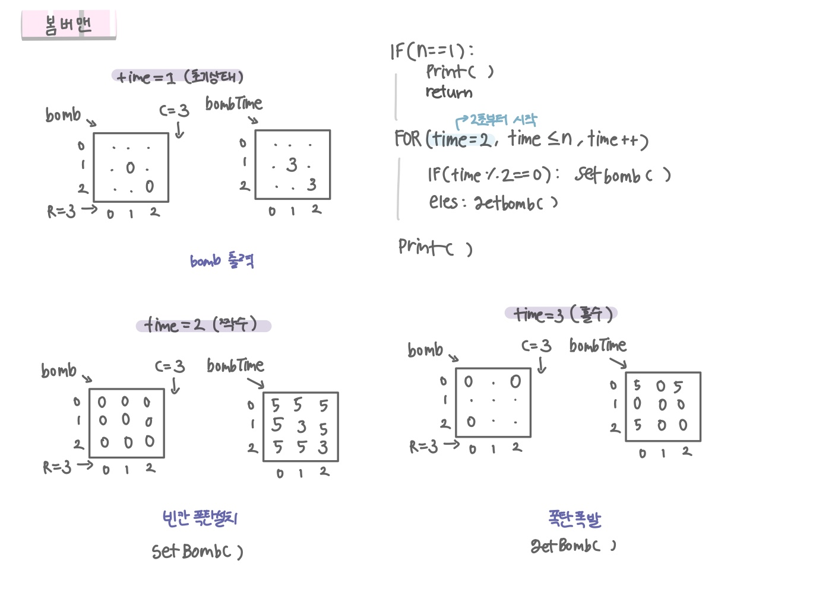

<br>

---

[https://www.acmicpc.net/problem/16918](https://www.acmicpc.net/problem/16918)

---

<br>

# 🔍 문제 풀이

## 문제 도식화

- `bombTime == time` 이면 동시 폭발이 진행되므로 건드리지 않고, 다르면 그 폭탄은 현 시점에 폭발하도록 함
- 예: `t=3`에 폭발하는 A 옆에 `t=5`에 터질 B가 있으면, `t=3`의 폭발로 B는 파괴되어 `t=5`에 폭발하지 않음



<br>

# 💻 코드

    ```java
    import java.io.*;
    import java.util.*;

    public class Main {
        static int r, c, n;
        static char[][] bomb;
        static int[][] bombtime;

        static int[] dx = {-1, 1, 0, 0};
        static int[] dy = {0, 0, -1, 1};

        public static void main(String[] args) throws IOException {
            BufferedReader br = new BufferedReader(new InputStreamReader(System.in));
            StringTokenizer st = new StringTokenizer(br.readLine());
            r = Integer.parseInt(st.nextToken());
            c = Integer.parseInt(st.nextToken());
            n = Integer.parseInt(st.nextToken());

            bomb = new char[r][c];
            bombtime = new int[r][c];

            // 초기 상태
            for (int i = 0; i < r; i++) {
                String line = br.readLine();
                for (int j = 0; j < c; j++) {
                    bomb[i][j] = line.charAt(j);
                    if (bomb[i][j] == 'O') {
                        bombtime[i][j] = 3; // 처음 설치된 폭탄은 3초에 터짐
                    }
                }
            }

            process();
        }

        static void process() {
            if (n == 1) { // 1초일 땐 초기 상태 그대로 출력
                print();
                return;
            }

            for (int time = 2; time <= n; time++) {
                if (time % 2 == 0) {
                    // 짝수초: 빈칸에 폭탄 설치, 폭발시각은 time+3
                    setBombs(time);
                } else {
                    // 홀수초: 이번 시각에 맞춘 폭탄들 폭발
                    getbomb(time);
                }
            }
            print();
        }


        // 빈칸에 폭탄 설치
        static void setBombs(int time) {
            for (int i = 0; i < r; i++) {
                for (int j = 0; j < c; j++) {
                    if (bomb[i][j] == '.') {
                        bomb[i][j] = 'O'; // 비어있는 모든 칸에 폭탄 설치
                        bombtime[i][j] = time + 3;  // 폭탄 설치 후 터질 시간 설정
                    }
                }
            }
        }

        // 이번 시각에 터질 폭탄 찾아서 처리
        public static void getbomb(int time) {
            for(int i=0; i<r; i++) {
                for(int j=0; j<c; j++) {
                    if(bombtime[i][j] == time) {
                        bomb(i,j, time);
                    }
                }
            }
        }

        // 폭탄 폭발
        static void bomb(int x, int y, int time) {
            bomb[x][y] = '.'
            bombtime[x][y] = 0;

            for (int d = 0; d < 4; d++) {
                int nx = x + dx[d];
                int ny = y + dy[d];

                if (nx < 0 || ny < 0 || nx >= r || ny >= c) continue;

                if(bomb[nx][ny]=='O' && bombtime[nx][ny] != time) { // 같은 시각에 터질 폭탄 건드리면 안됨 (주의)
                    bomb[nx][ny] = '.';
                    bombtime[nx][ny] = 0;
                }
            }

        }

        static void print() {
            for (int i = 0; i < r; i++) {
                for (int j = 0; j < c; j++){
                    System.out.print(bomb[i][j]);
                }
                System.out.println();
            }
        }
    }
    ```

    <br>
