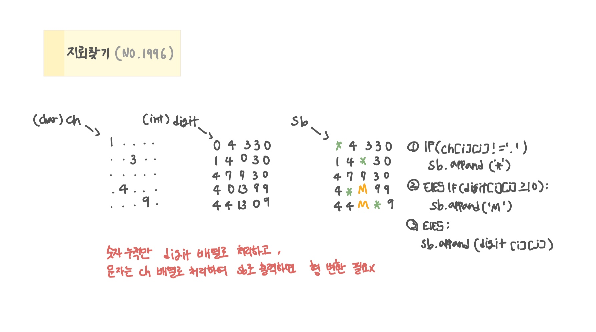

<br>

---

[https://www.acmicpc.net/problem/1996](https://www.acmicpc.net/problem/1996)

---

<br>

# 🔍 문제 풀이

## 문제 도식화



<br>

# 💻 코드

```java
import java.io.*;
import java.util.*;

public class Main {
    static int n;
    static char[][] ch;
    static int[][] digit;

    static int[] dx = {-1, -1, -1, 0, 1, 1, 1, 0};
    static int[] dy = {-1, 0, 1, 1, 1, 0, -1, -1};

    public static void main(String[] args) throws IOException {
        // input
        BufferedReader br = new BufferedReader(new InputStreamReader(System.in));

        StringTokenizer st = new StringTokenizer(br.readLine());
        n = Integer.parseInt(st.nextToken());

        ch = new char[n][n];
        digit = new int[n][n];

        for(int i=0; i<n; i++){
            String line = br.readLine();
            for(int j=0; j<n; j++){
                ch[i][j] = line.charAt(j);
            }
        }

        // solve
        for(int i=0; i<n; i++){
            for(int j=0; j<n; j++){
                if(ch[i][j] != '.'){
                    solve(i, j);
                }
            }
        }

        // output
        StringBuilder sb = new StringBuilder();
        for(int i=0; i<n; i++){
            for(int j=0; j<n; j++){
                if(ch[i][j] != '.') sb.append('*');
                else if(digit[i][j] >= 10) sb.append('M');
                else sb.append(digit[i][j]);
            }
            sb.append("\n");
        }
        System.out.println(sb);
    }

    // 지뢰칸 기준 8방향 빈칸에 값 누적
    static void solve(int x, int y) {
        int mine = ch[x][y] - '0';

        for(int d = 0; d<8; d++){
            int nx = x + dx[d];
            int ny = y + dy[d];

            if(nx < 0 || nx >= n || ny < 0 || ny >= n) continue;
            if(ch[nx][ny] != '.') continue;

            digit[nx][ny] += mine;
        }
    }
}
```

<br>
