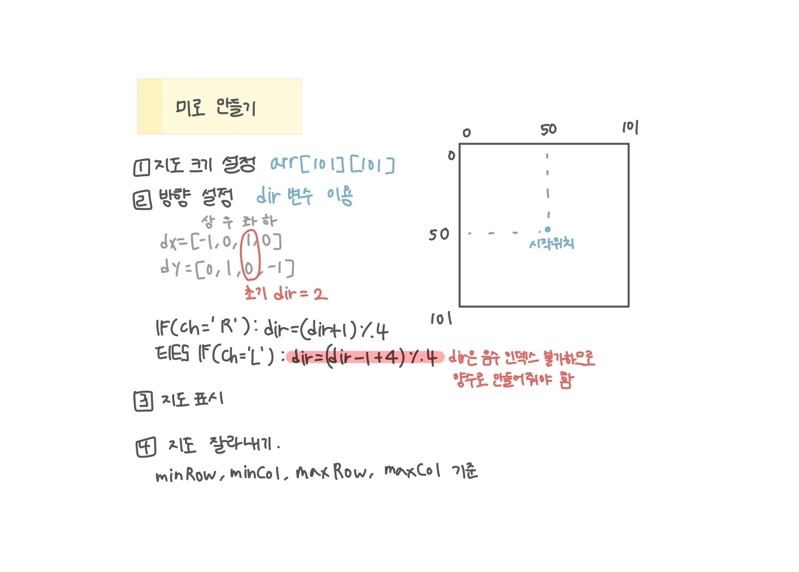

<br>

---

[https://www.acmicpc.net/problem/1347](https://www.acmicpc.net/problem/1347)

---

<br>

# 🔍 문제 풀이

## 문제 도식화



- 배열의 크기를`arr[101][101]` 배열로 설정하고, 시작점을 배열의 중앙인 **(50, 50)**으로 잡았다.
- 주어진 명령의 최대 횟수는 최대 50회이기 때문에 홍준이가 어느 방향으로 이동하든 배열의 범위를 벗어나지 않는다.

<br>

# 💻 코드

```java
import java.io.*;
import java.util.*;

public class Main {
    // 상우하좌
    static int[] dx = {-1, 0, 1, 0};
    static int[] dy = {0, 1, 0, -1};

    public static void main(String[] args) throws IOException {
        BufferedReader br = new BufferedReader(new InputStreamReader(System.in));

        int n = Integer.parseInt(br.readLine());
        String str = br.readLine();

        char[][] arr = new char[101][101];

        int dir = 2; // 남쪽(하)

        int x = 50, y = 50;
        int minRow = 50, maxRow = 50, minCol = 50, maxCol = 50;

        arr[x][y] = '.';

        for (int i = 0; i < n; i++) {
            char ch = str.charAt(i);
            if (ch == 'F') { // 앞으로 한 칸
                x += dx[dir];
                y += dy[dir];
                arr[x][y] = '.';

                minRow = Math.min(minRow, x);
                maxRow = Math.max(maxRow, x);
                minCol = Math.min(minCol, y);
                maxCol = Math.max(maxCol, y);
            } else if (ch == 'L') dir = (dir - 1 + 4) % 4; // 왼쪽으로 회전
            else if (ch == 'R') dir = (dir + 1) % 4; // 오른쪽으로 회전
        }

        for(int i=minRow; i<=maxRow; i++) {
            for(int j=minCol; j<=maxCol; j++){
                if(arr[i][j] != '.') arr[i][j] = '#';
                System.out.print(arr[i][j]);
            }
            System.out.println();
        }
    }
}
```

<br>
