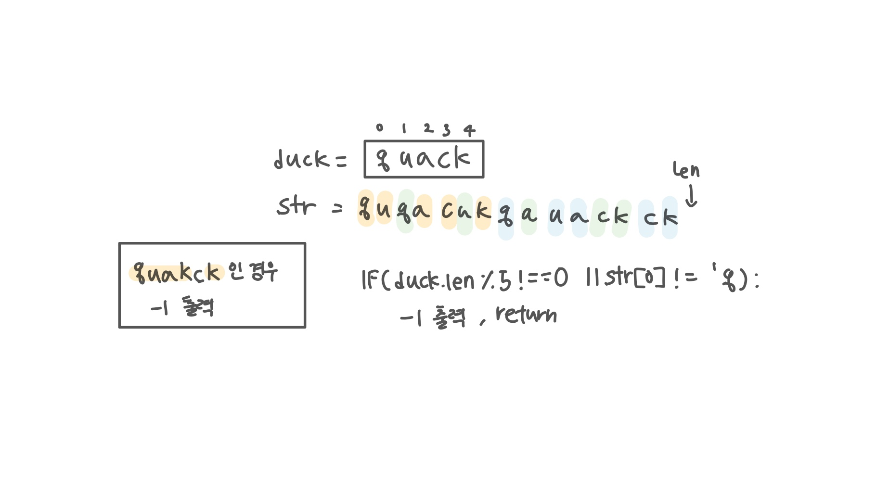

<br>

---

[https://www.acmicpc.net/problem/12933](https://www.acmicpc.net/problem/12933)

---

<br>

# 🔍 문제 풀이

## 문제 도식화



- `{'q', 'u', 'a', 'c', 'k'}`의 각 문자가 나타날 때마다 검사하는 대신, 'quack'이라는 하나의 완전한 소리가 완성되었을 때 처리해줘야 함
- 즉, 오리 한 마리의 울음소리가 완전히 끝나는 시점인 'k'가 나타날 때만 유효한 오리 한 마리로 계산해야 한다.
- 만약 모든 문자열을 순회했는데도 'quack'이 완성되지 않은 오리가 남아 있다면(예: 'quac'에서 끝나는 경우), 유효하지 않은 입력이므로 -1을 반환

<br>

# 💻 코드

```java
import java.io.*;

public class Main {
    public static void main(String[] args) throws IOException {
        BufferedReader br = new BufferedReader(new InputStreamReader(System.in));

        char[] str = br.readLine().toCharArray();
        boolean[] v = new boolean[str.length];

        char[] duck = {'q', 'u', 'a', 'c', 'k'};

        // 길이가 5의 배수가 아니거나 시작이 'q'가 아니면 불가능
        if(str.length % 5 != 0 || str[0] != 'q') {
            System.out.println(-1);
            return;
        }

        int ans = 0;
        while (true) {
            int idx = 0; // duck 인덱스
            boolean made = false;

            for(int i = 0; i <str.length; i++) {
                if(!v[i] && duck[idx] == str[i]) {
                    idx++;
                    v[i] = true;

                    if(idx == 5) { // quack 완성
                        idx = 0;
                        made = true;
                    }
                }
            }

            if(!made) break;
            ans ++;
        }

        // 모든 글자가 사용되었는지 확인
        for (int i = 0; i < str.length; i++) {
            if (!v[i]) {  // 하나라도 fale가 있으면 실패(사용되지 않았으면)
                System.out.println(-1);
                return;
            }
        }
        System.out.println(ans);
    }
}
```

<br>
