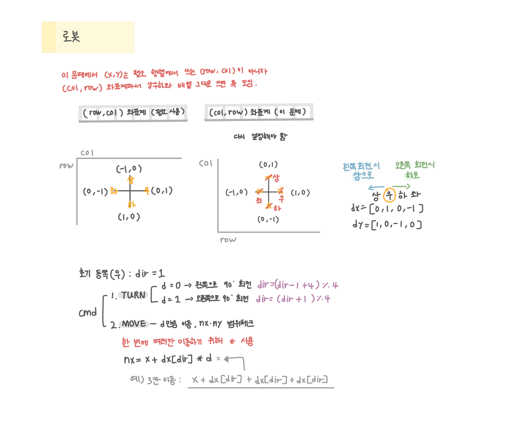

<br>

---

[https://www.acmicpc.net/problem/13567](https://www.acmicpc.net/problem/13567)

---

<br>

# 🔍 문제 풀이

## 문제 도식화



<br>

# 💻 코드

```java
import java.io.*;
import java.util.*;

public class Main {
    // 상우하좌 (col, row) 좌표계
    static int[] dx = {0, 1, 0, -1};
    static int[] dy = {1, 0, -1, 0};

    public static void main(String[] args) throws IOException {
        BufferedReader br = new BufferedReader(new InputStreamReader(System.in));

        StringTokenizer st = new StringTokenizer(br.readLine());
        int m = Integer.parseInt(st.nextToken()); // 정사각형 s의 한 변의 길이
        int n = Integer.parseInt(st.nextToken()); // 명령어 수

        int dir = 1;
        int x = 0, y = 0;

        for(int i=0; i<n; i++) {
            st = new StringTokenizer(br.readLine());
            String cmd = st.nextToken();
            int d = Integer.parseInt(st.nextToken());

            if(cmd.equals("MOVE")){
                // 한 번에 여러 칸 이동하기 위해 * 사용
                // 예) 5칸 이동: x + (dx[dir] + dx[dir] + dx[dir] + dx[dir] + dx[dir])
                int nx = x + dx[dir] * d;
                int ny = y + dy[dir] * d;

                // 범위 주의
                if(nx < 0 || nx > m || ny < 0 || ny > m){
                    System.out.println(-1);
                    return;
                }
                x = nx;
                y = ny;

            } else if(cmd.equals("TURN")){
                if(d == 0) dir = (dir + 3) % 4; // 왼쪽 회전
                else if(d == 1) dir = (dir + 1) % 4; // 오른쪽 회전
            }
        }

        System.out.println(x + " " + y);
    }
}
```

<br>
